**`CSS (Cascading style sheet)` 层叠样式表, 修饰网页样式的语法**

## 目录

- [样式属性](#样式属性)
- [内部样式表和css选择器](#内部样式表和css选择器)
    - [CSS选择器属性和优先级判断](#CSS选择器属性和优先级判断)
	- [关系选择器](#关系选择器)
		- [后代选择器](#后代选择器)
		- [子代关系选择器](#子代关系选择器)
		- [邻接兄弟](#邻接兄弟)
	- [伪类和伪元素](#伪类和伪元素)
		- [用户行为伪类](#用户行为伪类)
- [CSS文本属性样式](#CSS文本属性样式)
- [背景图的使用以及常见的图片格式](#背景图的使用以及常见的图片格式)
- [元素浮动](#元素浮动)
- [盒模型和边框以及边距](#盒模型和边框以及边距)
    - [页面布局组合](#页面布局组合)
- [在HTML中使用CSS文件](#在HTML中使用CSS文件)
- [CSS可使用的函数](#CSS可使用的函数)
	- [calc函数](#calc函数)
	- [transform函数](#transform函数)
- [@规则](#@规则)
- [层叠样式表](#层叠样式表)
	- [层叠](#层叠)
	- [!important特殊层叠](#!important特殊层叠)
	- [优先级](#优先级)
	- [继承](#继承)
		- [继承控制](#继承控制)
- [级联层的顺序](#级联层的顺序)
- [盒模型](#盒模型)
	- [块级盒子和内联盒子](#块级盒子和内联盒子)
	- [内部和外部显示类型](#内部和外部显示类型)
	- [不同显示类型的例子](#不同显示类型的例子)


## 样式属性

```html
<input type="submit" value="提交" style="width: 80px; height: 30px; background-color: #E06C75 ;" />
<!-- style是样式设置属性,   上面有设置了 宽度80px, 高度 30px, 背景颜色 -->
```


## 内部样式表和css选择器

- **写在普通标签内的样式  `style属性` , 称为 行内样式**
- **写在 `style标签` 内的样式属性,称为 内部样式**
- **行内样式 优先级大于 内部样式的优先级**,  
    - 当行内和内部 样式都设置了同一种属性, 那么只有行内样式的那个属性生效. 
    - 其他的属性则不影响

```html
<!-- 设置所有标签a, 也就是超链接的 标签属性 -->
<!-- 这个 a{} 被称为标签选择器, 他选择了让页面所有的 这个标签拥有这个属性 -->
<!-- #banner 代表  <div id="ndiv"></div> ,中的id号, 用来区分针对某个容器的属性设置,也就是ID选择器 -->
<!-- 让标签用 class 属性,来进行类别的区分, 分门归类, 会让同一类别的标签拥有 同一个 style标签 中的属性
       a超链接标签拥有 标签选择器的属性, 也有 .nav类别的属性, 那么页面所有a标签都拥有 标签选择器的属性
       只有 class="nav" 的a标签 才会拥有 标签选择器和.nav列表 两者相加的属性-->

<!-- #banner img { width: 100%; }  表示存在于 id="banner" 的容器内的 img标签才会拥有这个属性 
                    .类别也可以这么写,   .nav img {width: 100%; } -->
<!-- 连起来,  类选择器  .a.b {}    , id选择器  #id .a.b{}  , 这样来组合, 小心空格-->

<!DOCTYPE html>
<!-- 对html 进行修改,会影响整个页面的背景颜色 -->
<html >
	<head>
		<meta charset="utf-8">
		<title></title>
 <!-- 标签名: css选择器, #ID名 : id选择器,  .类名: class选择器 -->
		<style>
			html { background-color: #ddd;}
			body { margin: 0px; }
			a    {  text-decoration: none;  margin: 0 15px; }
			
			#banner { width:100%; }
			#navigation { text-align: center; height: 80px ; line-height: 80px; background-color: aliceblue; }
			#buttom { text-align: center; height: 40px; line-height: 40px; background-color: darkgrey; font-size: 16px; color: dimgrey; }
			
			.nav {   color: black; }
			
			#banner img { width: 100%; }
		</style>
	</head>
	<!-- 将网页两侧的一小些空白去掉, 这个是body产生的 -->
	<body>
		
		<!-- banner 横幅, 设置图片放大到原尺寸-->
		<div id="banner">
			
		</div>
			
		<!-- navigation 导航, 字体默认占用16px, 修改 行高 与高度相等 就可以让文字居中和垂直-->
		<div id="navigation" >
			   <!-- style="margin: 0 15px; 设置文本的上下距离为0, 左右距离为15px -->
               <!-- text-decoration: none; 是去掉下划线 属性 -->
			<a href="../index.html" calss="nav"> asasas </a>
			<a href="../index.html" calss="nav"> basasdasd </a>
			<a href="../index.html" calss="nav"> csdada </a>
			<a href="../index.html"> csadasd </a>
			<a href="../index.html"> dsdada </a>
		</div>
			
		<!-- butten 底部 -->
		<div id="buttom" >
			版权所有
		</div>
		
	</body>
</html>
```


### CSS选择器属性和优先级判断

- **css选择器属性:**
    - **ID选择器 不可以重名( `<style> #banner{ background-color: #ddd;} </style>`)**
    - **标签选择器 根据标签名来选择相对的属性( `<style> html { background-color: #ddd;} </style>`)**
    - **类别选择器,拥有该类别class的多个元素( `<style> .dav { background-color: #ddd;} </style>`)**
        - 同一个标签 可以拥有多个 class类名, `<a class="one two"></a>`
    - **通用选择器,针对页面所有标签( `<style> * { background-color: #ddd;} </style>`)**
- 选择器也有优先级( 如果出现嵌套就不一定了)
    - **通用  < 标签  < Class < ID  < 行内样式**
- **也可以通过权重值来进行计算优先级和生效的属性, 权重最高的会生效**
    - `*`**通用选择器, 权重0**
    - `p, div` **标签(元素)选择器, 权重 1**
    - `.pid` **类(别)选择器, 权重10** 
    - `#pid` **ID选择器, 权重 100**
    - `stple=""` **行内样式, 权重1000**
- **选择器选择的范围越小 越精确, 优先级就越高**

```html
<!DOCTYPE html>
<html>
	<head>
		<meta charset="utf-8">
		<title></title>
		<style type="text/css">
			p {color: yellow;}
			div p{color : green; }
			.demo p{color: black;}
			#demo p{color: orange;}
			div #demo p{color: gray;}
		</style>
	</head>	
	<body>
		<p >猜颜色 class="demo"</p>
	<div><p >猜颜色 class="demo"</p></div>
	<div class="demo">
		<p >猜颜色 class="demo"</p>
	</div>
	<div id="demo">
		<p  >猜颜色  id="demo"</p>
	</div>
	</body>
</html>
```

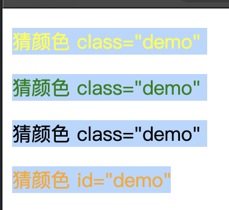


```html
<!-- 另一种属性选择器 -->
<!doctype html>
<html lang="zh-CN">
  <head>
    <meta charset="utf-8" />
    <meta name="viewport" content="width=device-width" />
    <title>我的 CSS 实验</title>
    <link rel="stylesheet" href="styles.css" />
  </head>
  <body>

    
    <h1>Attribute presence and value selectors</h1>
    <ul>
      <li>Item 1</li>
        <li class="a">Item 2</li>
        <li class="a b">Item 3</li>
        <li class="ab">Item 4</li>
    </ul>

    
    
  </body>
</html>
```

```css
li[class] {   /* <li> 标签 如果存在 class 属性的话，就进行选择，字体放大  */
    font-size: 200%;
  }
  
  li[class="a"] {  /* 选择 class 等于 a 的 <li> 标签 */
    background-color: yellow;
  }
  
  li[class~="a"] { /* 选择 class 包含 a 的 <li> 标签，但是只有 a 的话是不会进行选择的 */
    color: red;
  }
```
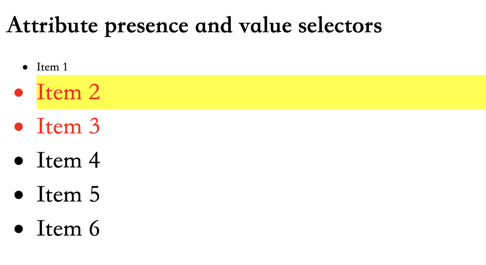


### 关系选择器
我们要了解的最后一种选择器被命名为关系选择器（Combinator），这是因为它们在其他选择器之间和其他选择器与文档内容的位置之间建立了一种有用的关系的缘故。

#### 后代选择器
后代选择器——典型用单个空格（" "）字符——组合两个选择器，比如，第二个选择器匹配的元素被选择，如果他们有一个祖先（父亲，父亲的父亲，父亲的父亲的父亲，等等）元素匹配第一个选择器。选择器利用后代组合符被称作后代选择器。

```html
    <div class="box"><p>Text in .box</p></div>
    <p>Text not in .box</p>
```
```css
.box p {
  color: red;
}
```
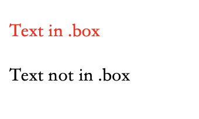

#### 子代关系选择器
子代关系选择器是个大于号（>），只会在选择器选中直接子元素的时候匹配。继承关系上更远的后代则不会匹配。例如，只选中作为<article>的直接子元素的<p>元素： `article > p`
```html
<ul>
  <li>Unordered item</li>
  <li>Unordered item
    <ol>
      <li>Item 1</li>
      <li>Item 2</li>
    </ol>
  </li>
</ul>
```
```css
ul > li {
  border-top: 5px solid red;
}
```
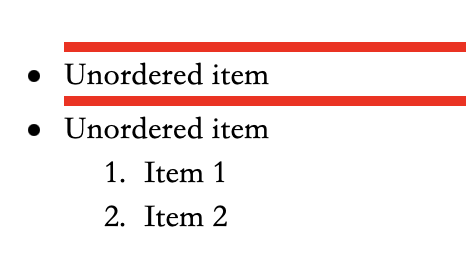


#### 邻接兄弟
邻接兄弟选择器（+）用来选中恰好处于另一个在继承关系上同级的元素旁边的物件。例如，选中所有紧随<p>元素之后的元素：`p + img`
常见的使用场景是，改变紧跟着一个标题的段的某些表现方面，就像是我下面的示例那样。这里我们寻找一个紧挨<h1>的段，然后样式化它。
如果你往<h1>和<p>之间插入其他的某个元素，例如<h2>，你将会发现，段落不再与选择器匹配，因而不会应用元素邻接时的前景和背景色。

```html
<article>
  <h1>A heading</h1>
    <p>Veggies es bonus vobis, proinde vos postulo essum magis kohlrabi welsh onion daikon amaranth tatsoi tomatillo
            melon azuki bean garlic.</p>

    <p>Gumbo beet greens corn soko endive gumbo gourd. Parsley shallot courgette tatsoi pea sprouts fava bean collard
            greens dandelion okra wakame tomato. Dandelion cucumber earthnut pea peanut soko zucchini.</p>
</article>
```
```css
h1 + p {
  font-weight: bold;
  background-color: #333;
  color: #fff;
  padding: .5em;
}
```
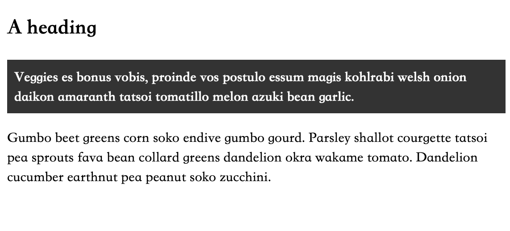

#### 通用兄弟
如果你想选中一个元素的兄弟元素，即使它们不直接相邻，你还是可以使用通用兄弟关系选择器（~）。要选中所有的<p>元素后任何地方的元素，我们会这样做：`p ~ img`
在下面的示例中，我们选中了所有的 <h1>之后的<p>元素，虽然文档中还有个 <div>，其后的<p>还是被选中了。

```html
<article>
  <h1>A heading</h1>
  <p>I am a paragraph.</p>
  <div>I am a div</div>
  <p>I am another paragraph.</p>
</article>
```
```css
h1 ~ p {
  font-weight: bold;
  background-color: #333;
  color: #fff;
  padding: .5em;
}
```
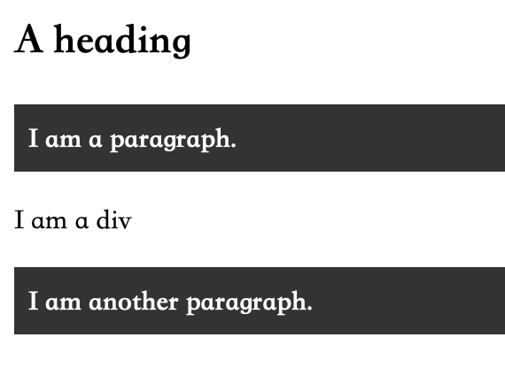


### 伪类和伪元素
选择器被称为伪类和伪元素。
伪类是选择器的一种，它用于选择处于特定状态的元素，比如当它们是这一类型的第一个元素时，或者是当鼠标指针悬浮在元素上面的时候。它们表现得会像是你向你的文档的某个部分应用了一个类一样，帮你在你的标记文本中减少多余的类，让你的代码更灵活、更易于维护。

伪类就是开头为冒号的关键字：`:pseudo-class-name`
```html
    <article>
      <p>Veggies es bonus vobis, proinde vos postulo essum magis kohlrabi welsh onion daikon amaranth tatsoi tomatillo
                melon azuki bean garlic.</p>
    
        <p>Gumbo beet greens corn soko endive gumbo gourd. Parsley shallot courgette tatsoi pea sprouts fava bean collard
                greens dandelion okra wakame tomato. Dandelion cucumber earthnut pea peanut soko zucchini.</p>
    </article>
```
```css
/* 我们可以使用:first-child伪类选择器——这将一直选中文章中的第一个子元素  */
article p:first-child {
  font-size: 120%;
  font-weight: bold;
}
/* 这段 CSS 代码表示选择 article 元素内的第一个 <p> 元素，并对其应用特定的样式。具体来说，
      样式规则包括将字体大小设置为比默认大小大 20%（即 120%），并将字体加粗。
   这个选择器结合了两个伪类：first-child 和 p
      first-child 选择器选择作为父元素的第一个子元素的元素，而 p 选择器选择所有 <p> 元素。
      因此，article p:first-child 选择了 article 元素内的第一个 <p> 元素。

其他的几种伪类选择器
:last-child
:only-child
:invalid

 */
```
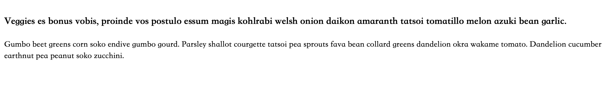

#### 用户行为伪类
一些伪类只会在用户以某种方式和文档交互的时候应用。这些用户行为伪类，有时叫做动态伪类，表现得就像是一个类在用户和元素交互的时候加到了元素上一样
- `:hover` 只会在用户将指针挪到元素上的时候才会激活，一般就是链接元素。
- `:focus` ——只会在用户使用键盘控制，选定元素的时候激活。

伪类范例：
```html
    <form>
      <p>Which flavor would you like to order?</p>
      <label>Full Name: <input name="firstName" type="text" /></label>
      <label
        >Flavor:
        <select name="flavor">
          <option>Cherry</option>
          <option>Green Tea</option>
          <option>Moose Tracks</option>
          <option>Mint Chip</option>
        </select>
      </label>
    </form>
```
```css
 label {
  display: block;
  margin-top: 1em;
}

input:focus {
  background-color: lightblue;
}

select:focus {
  background-color: red;
}
```
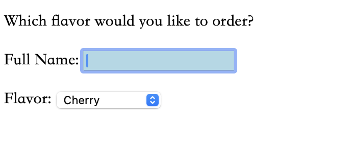

#### 伪元素
伪元素开头为双冒号::
`::first-line` 伪元素选择器 即使单词/字符的数目改变，它也只会选中第一行。

```html
<article>
  <p>Veggies es bonus vobis, proinde vos postulo essum magis kohlrabi welsh onion daikon amaranth tatsoi tomatillo
            melon azuki bean garlic.</p>

    <p>Gumbo beet greens corn soko endive gumbo gourd. Parsley shallot courgette tatsoi pea sprouts fava bean collard
            greens dandelion okra wakame tomato. Dandelion cucumber earthnut pea peanut soko zucchini.</p>
</article>
```
```css
/* 这表现得就像是<span>神奇地包在第一个被格式化的行一样，每当行长改变的时候还会更新。
你可以看到它把两段的第一行都选中了。
*/
article p::first-line {
  font-size: 120%;
  font-weight: bold;
}
```
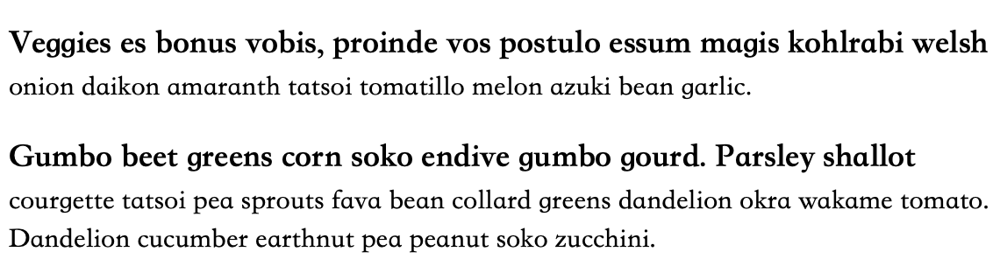

#### 把伪类和伪元素组合起来
如果你想让第一段的第一行加粗，你需要把:first-child和::first-line选择器放到一起。选择一个<article>元素里面的第一个<p>元素的第一行。

```html
<article>
  <p>Veggies es bonus vobis, proinde vos postulo essum magis kohlrabi welsh onion daikon amaranth tatsoi tomatillo
            melon azuki bean garlic.</p>

    <p>Gumbo beet greens corn soko endive gumbo gourd. Parsley shallot courgette tatsoi pea sprouts fava bean collard
            greens dandelion okra wakame tomato. Dandelion cucumber earthnut pea peanut soko zucchini.</p>
</article>
```
```css
article p:first-child::first-line {
  font-size: 120%;
  font-weight: bold;
}
```
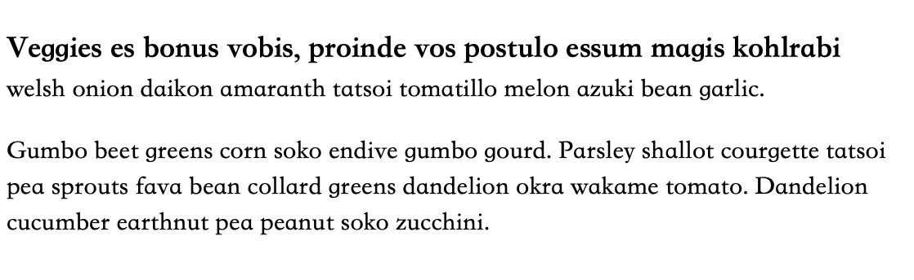

生成带有::before 和::after 的内容
有一组特别的伪元素，它们和content属性一同使用，使用 CSS 将内容插入到你的文档中。
你能用这些插入一个文本字符串，和在下面的实时示例里那样。试着改变content属性的文本值，看看输出是怎么改变的。你也能改变::before伪元素为::after，看到这段文本插入到了元素的末尾而不是开头。
```html
<p class="box">Content in the box in my HTML page.</p>
```
```css
.box::before {
  content: "This should show before the other content. ";
}
```
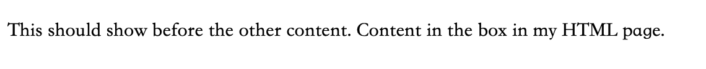

这些伪元素的更推荐的用法是插入一个图标，例如下面的示例加入的一个小箭头，作为一个视觉性的提示，而且我们并不希望屏幕阅读器读出它。
```html
<p class="box">Content in the box in my HTML page.</p>
```
```css
.box::after {
  content: " ➥";
}
```
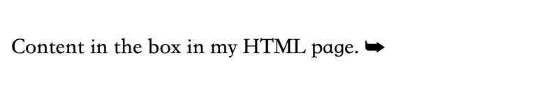


::before和::after伪元素与content属性的共同使用，在 CSS 中被叫做“生成内容”，而且你会见到这种技术被用于完成各种任务。CSS Arrow Please网站就是一个著名的示例，它帮你用 CSS 生成一个箭头。在你创建你的箭头的时候看下 CSS，你将会看到实际使用的::before和::after伪元素。无论什么时候你看到了这些选择器，都要看下content属性，以了解文档中添加了什么。


```css
.box::before {	 	 /* 在 .box 类之前 */
  content: "";       /* 设置了伪元素的内容为空。 */
  display: block;	 /* 伪元素定义为块级元素，使其占据一行。 */
  width: 100px;
  height: 100px;
  background-color: rebeccapurple;  /* 给伪元素设置了背景色，颜色为 rebeccapurple。 */
  border: 1px solid black; /* 给伪元素设置了 1 像素宽的黑色实线边框。 */
} 
```
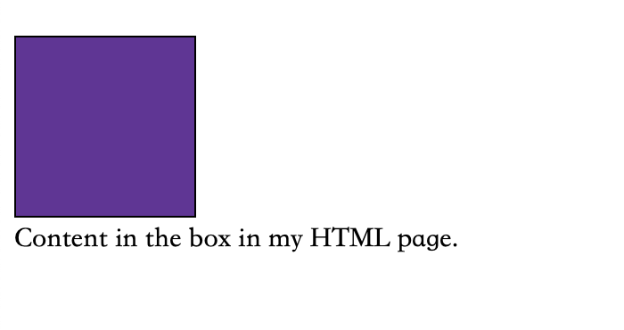


**伪类**

| 选择器                                                       | 描述                                                         |
| :----------------------------------------------------------- | :----------------------------------------------------------- |
| [`:active`](https://developer.mozilla.org/zh-CN/docs/Web/CSS/:active) | 在用户激活（例如点击）元素的时候匹配。                       |
| [`:any-link`](https://developer.mozilla.org/zh-CN/docs/Web/CSS/:any-link) | 匹配一个链接的`:link`和`:visited`状态。                      |
| [`:blank`](https://developer.mozilla.org/zh-CN/docs/Web/CSS/:blank) | 匹配空输入值的[``元素](https://developer.mozilla.org/zh-CN/docs/Web/HTML/Element/input)。 |
| [`:checked`](https://developer.mozilla.org/zh-CN/docs/Web/CSS/:checked) | 匹配处于选中状态的单选或者复选框。                           |
| [`:current` (en-US)](https://developer.mozilla.org/en-US/docs/Web/CSS/:current) | 匹配正在展示的元素，或者其上级元素。                         |
| [`:default`](https://developer.mozilla.org/zh-CN/docs/Web/CSS/:default) | 匹配一组相似的元素中默认的一个或者更多的 UI 元素。           |
| [`:dir`](https://developer.mozilla.org/zh-CN/docs/Web/CSS/:dir) | 基于其方向性（HTML[`dir`](https://developer.mozilla.org/zh-CN/docs/Web/HTML/Global_attributes/dir)属性或者 CSS[`direction`](https://developer.mozilla.org/zh-CN/docs/Web/CSS/direction)属性的值）匹配一个元素。 |
| [`:disabled`](https://developer.mozilla.org/zh-CN/docs/Web/CSS/:disabled) | 匹配处于关闭状态的用户界面元素                               |
| [`:empty`](https://developer.mozilla.org/zh-CN/docs/Web/CSS/:empty) | 匹配除了可能存在的空格外，没有子元素的元素。                 |
| [`:enabled`](https://developer.mozilla.org/zh-CN/docs/Web/CSS/:enabled) | 匹配处于开启状态的用户界面元素。                             |
| [`:first`](https://developer.mozilla.org/zh-CN/docs/Web/CSS/:first) | 匹配[分页媒体](https://developer.mozilla.org/zh-CN/docs/Web/CSS/CSS_paged_media)的第一页。 |
| [`:first-child`](https://developer.mozilla.org/zh-CN/docs/Web/CSS/:first-child) | 匹配兄弟元素中的第一个元素。                                 |
| [`:first-of-type`](https://developer.mozilla.org/zh-CN/docs/Web/CSS/:first-of-type) | 匹配兄弟元素中第一个某种类型的元素。                         |
| [`:focus`](https://developer.mozilla.org/zh-CN/docs/Web/CSS/:focus) | 当一个元素有焦点的时候匹配。                                 |
| [`:focus-visible`](https://developer.mozilla.org/zh-CN/docs/Web/CSS/:focus-visible) | 当元素有焦点，且焦点对用户可见的时候匹配。                   |
| [`:focus-within`](https://developer.mozilla.org/zh-CN/docs/Web/CSS/:focus-within) | 匹配有焦点的元素，以及子代元素有焦点的元素。                 |
| [`:future` (en-US)](https://developer.mozilla.org/en-US/docs/Web/CSS/:future) | 匹配当前元素之后的元素。                                     |
| [`:hover`](https://developer.mozilla.org/zh-CN/docs/Web/CSS/:hover) | 当用户悬浮到一个元素之上的时候匹配。                         |
| [`:indeterminate`](https://developer.mozilla.org/zh-CN/docs/Web/CSS/:indeterminate) | 匹配未定态值的 UI 元素，通常为[复选框](https://developer.mozilla.org/zh-CN/docs/Web/HTML/Element/input/checkbox)。 |
| [`:in-range`](https://developer.mozilla.org/zh-CN/docs/Web/CSS/:in-range) | 用一个区间匹配元素，当值处于区间之内时匹配。                 |
| [`:invalid`](https://developer.mozilla.org/zh-CN/docs/Web/CSS/:invalid) | 匹配诸如`<input>`的位于不可用状态的元素。                    |
| [`:lang`](https://developer.mozilla.org/zh-CN/docs/Web/CSS/:lang) | 基于语言（HTML[lang](https://developer.mozilla.org/zh-CN/docs/Web/HTML/Global_attributes/lang)属性的值）匹配元素。 |
| [`:last-child`](https://developer.mozilla.org/zh-CN/docs/Web/CSS/:last-child) | 匹配兄弟元素中最末的那个元素。                               |
| [`:last-of-type`](https://developer.mozilla.org/zh-CN/docs/Web/CSS/:last-of-type) | 匹配兄弟元素中最后一个某种类型的元素。                       |
| [`:left`](https://developer.mozilla.org/zh-CN/docs/Web/CSS/:left) | 在[分页媒体](https://developer.mozilla.org/zh-CN/docs/Web/CSS/CSS_paged_media)中，匹配左手边的页。 |
| [`:link`](https://developer.mozilla.org/zh-CN/docs/Web/CSS/:link) | 匹配未曾访问的链接。                                         |
| [`:local-link`(en-US)](https://developer.mozilla.org/en-US/docs/Web/CSS/:local-link) | 匹配指向和当前文档同一网站页面的链接。                       |
| [`:is()`](https://developer.mozilla.org/zh-CN/docs/Web/CSS/:is) | 匹配传入的选择器列表中的任何选择器。                         |
| [`:not`](https://developer.mozilla.org/zh-CN/docs/Web/CSS/:not) | 匹配作为值传入自身的选择器未匹配的物件。                     |
| [`:nth-child`](https://developer.mozilla.org/zh-CN/docs/Web/CSS/:nth-child) | 匹配一列兄弟元素中的元素——兄弟元素按照*an+b*形式的式子进行匹配（比如 2n+1 匹配元素 1、3、5、7 等。即所有的奇数个）。 |
| [`:nth-of-type`](https://developer.mozilla.org/zh-CN/docs/Web/CSS/:nth-of-type) | 匹配某种类型的一列兄弟元素（比如，`<p>`元素）——兄弟元素按照*an+b*形式的式子进行匹配（比如 2n+1 匹配元素 1、3、5、7 等。即所有的奇数个）。 |
| [`:nth-last-child`](https://developer.mozilla.org/zh-CN/docs/Web/CSS/:nth-last-child) | 匹配一列兄弟元素，从后往前倒数。兄弟元素按照*an+b*形式的式子进行匹配（比如 2n+1 匹配按照顺序来的最后一个元素，然后往前两个，再往前两个，诸如此类。从后往前数的所有奇数个）。 |
| [`:nth-last-of-type`](https://developer.mozilla.org/zh-CN/docs/Web/CSS/:nth-last-of-type) | 匹配某种类型的一列兄弟元素（比如，`<p>`元素），从后往前倒数。兄弟元素按照*an+b*形式的式子进行匹配（比如 2n+1 匹配按照顺序来的最后一个元素，然后往前两个，再往前两个，诸如此类。从后往前数的所有奇数个）。 |
| [`:only-child`](https://developer.mozilla.org/zh-CN/docs/Web/CSS/:only-child) | 匹配没有兄弟元素的元素。                                     |
| [`:only-of-type`](https://developer.mozilla.org/zh-CN/docs/Web/CSS/:only-of-type) | 匹配兄弟元素中某类型仅有的元素。                             |
| [`:optional`](https://developer.mozilla.org/zh-CN/docs/Web/CSS/:optional) | 匹配不是必填的 form 元素。                                   |
| [`:out-of-range`](https://developer.mozilla.org/zh-CN/docs/Web/CSS/:out-of-range) | 按区间匹配元素，当值不在区间内的的时候匹配。                 |
| [`:past` (en-US)](https://developer.mozilla.org/en-US/docs/Web/CSS/:past) | 匹配当前元素之前的元素。                                     |
| [`:placeholder-shown`](https://developer.mozilla.org/zh-CN/docs/Web/CSS/:placeholder-shown) | 匹配显示占位文字的 input 元素。                              |
| [`:playing`](https://developer.mozilla.org/zh-CN/docs/Web/CSS/:playing) | 匹配代表音频、视频或者相似的能“播放”或者“暂停”的资源的，且正在“播放”的元素。 |
| [`:paused`](https://developer.mozilla.org/zh-CN/docs/Web/CSS/:paused) | 匹配代表音频、视频或者相似的能“播放”或者“暂停”的资源的，且正在“暂停”的元素。 |
| [`:read-only`](https://developer.mozilla.org/zh-CN/docs/Web/CSS/:read-only) | 匹配用户不可更改的元素。                                     |
| [`:read-write`](https://developer.mozilla.org/zh-CN/docs/Web/CSS/:read-write) | 匹配用户可更改的元素。                                       |
| [`:required`](https://developer.mozilla.org/zh-CN/docs/Web/CSS/:required) | 匹配必填的 form 元素。                                       |
| [`:right`](https://developer.mozilla.org/zh-CN/docs/Web/CSS/:right) | 在[分页媒体](https://developer.mozilla.org/zh-CN/docs/Web/CSS/CSS_paged_media)中，匹配右手边的页。 |
| [`:root`](https://developer.mozilla.org/zh-CN/docs/Web/CSS/:root) | 匹配文档的根元素。                                           |
| [`:scope`](https://developer.mozilla.org/zh-CN/docs/Web/CSS/:scope) | 匹配任何为参考点元素的的元素。                               |
| [`:valid`](https://developer.mozilla.org/zh-CN/docs/Web/CSS/:valid) | 匹配诸如`<input>`元素的处于可用状态的元素。                  |
| [`:target`](https://developer.mozilla.org/zh-CN/docs/Web/CSS/:target) | 匹配当前 URL 目标的元素（例如如果它有一个匹配当前[URL 分段](https://en.wikipedia.org/wiki/Fragment_identifier)的元素）。 |
| [`:visited`](https://developer.mozilla.org/zh-CN/docs/Web/CSS/:visited) | 匹配已访问链接。                                             |


**伪元素列表**

| 选择器                                                       | 描述                                                 |
| :----------------------------------------------------------- | :--------------------------------------------------- |
| [`::after`](https://developer.mozilla.org/zh-CN/docs/Web/CSS/::after) | 匹配出现在原有元素的实际内容之后的一个可样式化元素。 |
| [`::before`](https://developer.mozilla.org/zh-CN/docs/Web/CSS/::before) | 匹配出现在原有元素的实际内容之前的一个可样式化元素。 |
| [`::first-letter`](https://developer.mozilla.org/zh-CN/docs/Web/CSS/::first-letter) | 匹配元素的第一个字母。                               |
| [`::first-line`](https://developer.mozilla.org/zh-CN/docs/Web/CSS/::first-line) | 匹配包含此伪元素的元素的第一行。                     |
| [`::grammar-error`](https://developer.mozilla.org/zh-CN/docs/Web/CSS/::grammar-error) | 匹配文档中包含了浏览器标记的语法错误的那部分。       |
| [`::selection`](https://developer.mozilla.org/zh-CN/docs/Web/CSS/::selection) | 匹配文档中被选择的那部分。                           |
| [`::spelling-error`](https://developer.mozilla.org/zh-CN/docs/Web/CSS/::spelling-error) | 匹配文档中包含了浏览器标记的拼写错误的那部分。       |


## CSS文本属性样式

> **CSS文本属性:   颜色, 字体, 行高, 大小, 加粗, 倾斜, 首行缩紧, 水平对齐, 文字修饰**

```html
<!DOCTYPE html>
<html>
	<head>
		<meta charset="utf-8">
		<title></title>
		<style style="text/css">
			 .p1 {color: red;}    /* 颜色 */
			 .p2 {font-family: "monaco"; }  /* 字体  */
			 .p3 {font-size: 26px;}     /* 字号 */
			 .p4 {font-weight: bold;}   /* 加粗 */
			 .p5 {font-style: italic; }   /* 文字倾斜 */
			 .p6 {text-indent: 60px;}   /* 首行缩紧*/
			 .p7 {text-align: center;}   /* 水平对齐方式,居中 */
			 .p8 {line-height: 100px;}  /* 行高 */
			 .p9 {height: 100px ; line-height: 100px;background-color: gray;}  /* 垂直居中,同时设置行的高度和字的高度,设置背景颜色 */
			 .p10 { text-decoration: underline;}  /* 文本修饰,只是给文字增加了下划线 */ 
		</style>
	</head>
	<body>
		<ul>
			<li class="p1" >aaaaaaaaaaaaaaaaaaaa</li>
			<li class="p2">bbbbbbbbbbbbbbbbbbbb</li>
			<li class="p3">cccccccccccccccccccc</li>
			<li class="p4" >dddddddddddddddddddd</li>
			<li class="p5">eeeeeeeeeeeeeeeeeeee</li>
			<li class="p6">ffffffffffffffffffff</li>
			<li class="p7">gggggggggggggggggggg</li>
			<li class="p8">hhhhhhhhhhhhhhhhhhhh</li>
			<li class="p9">iiiiiiiiiiiiiiiiiiii</li>
			<li class="p10">jjj撒打算打算jjjjjjjjjjjjjjjjj</li>
		</ul>
	</body>
</html>
```

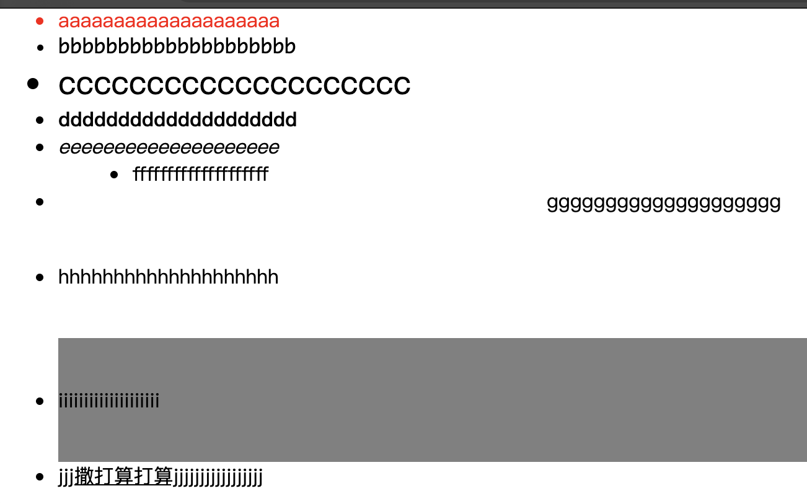


## 背景图的使用以及常见的图片格式

- **gif**
    - **支持动画**
    - 只有全透明和不透明两种模式
    - 只有256种颜色,无法保存色彩较为丰富的照片
- **jpg**
    - 有损压缩算法
    - 体积较小
    - 不支持透明
    - **不支持动画**
- **png(使用最多)**
    - **采用无损压缩算法**
    - 体积相对较小
    - 支持背景透明
    - **不支持动画**
- **svg**
    - 不会失真的图片
    - 它是一串代码,记录这图片的矢量信息
    - **保存颜色和形状丰富的照片 体积会大的惊人**

```html
<!DOCTYPE html>
<html>
	<head>
		<meta charset="utf-8">
		<title></title>

	</head>
	<style type="text/css">
		html,body {
			margin: 0;    /* 去除网页周围的滚动条 */
			height: 100%;  /* 让body 与 html 的高宽相同 */
		}
		body {
			background-image: url(img/5_60x60.png);
			background-repeat: no-repeat;   /* 不让背景图进行平铺 */
			background-position: center center;   /* 让背景图片 居中显示 */
		}
	</style>
	<body></body>
</html>
```

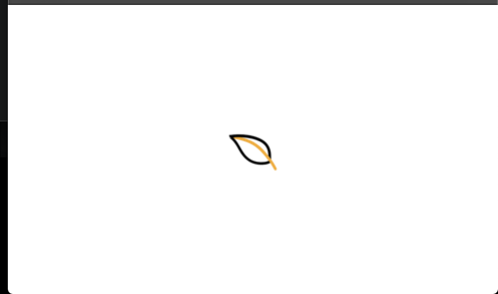

## 元素浮动

- **浮动元素会脱离网页文档, 与其他元素发生重叠, 不会与文字内容发生重叠,而是会将文字挤走**
- **浮动元素不会撑开父容器的大小. 因为是浮动的**
    - **所以父元素必须设置大小**
    - 或者给父元素增加属性 `clear: both;` 或 `clear: left` 不受左右浮动影响, 和单独的左浮动影响
- **浮动元素排列的时候, 只参考前一个元素的位置即可**
- **浮动元素的重叠问题**
    - 浮动元素不会覆盖文字内容
    - 浮动元素不会覆盖图片内容
        - 图片本身也属于文本, 可以把图片看成是一个特殊的文字
    - 浮动元素不会覆盖表单元素
        - 输入框, 单选按钮, 复选框, 按钮, 下拉选择框等.

```html
<!DOCTYPE html>
<html>
	<head>
		<meta charset="utf-8">
		<title></title>
	</head>
	<style type="text/css">
		.a { width: 20% ;background-color: orangered;
		}
		.b {width: 60% ;background-color: green;
		}
		.c {width: 20% ;background-color: blue;
		}
		.a,.b,.c{ height: 200px;  float: left;}
		.hh {height: 360px; background-color: #808080;}
		.outer {height: 200px; clear: both;}
	</style>
	<body>
		<div class="outer">
			<div class="a"></div>
			<div class="b"></div>
			<div class="c"></div>
		</div>
		<div class="hh"></div>
	</body>
</html>

```

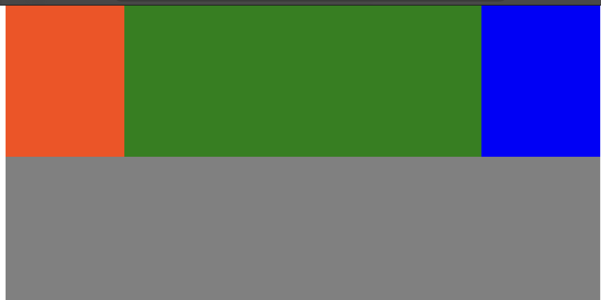

```html
<!-- 一个页面窗口 -->
<!DOCTYPE html>
<html>
	<head>
		<meta charset="utf-8">
		<title></title>
	</head>
	<style type="text/css">
		ul {
			/* background-color: green; */
			width: 300px; height: 500px;
			clear: both;
			border-width: 1px;   /* 边框的宽度 */
			border-style: solid;  /* 显示边框 */
			border-color: black;   /*容器内文字的颜色 */
		}
		
		.l {
			float: left;
		}
		.r {
			float: right;
		}
		.l,.r{			
			width: 30%;
			line-height: 40px;
			height: 40px;
			text-align: center;
			clear: both;
			background-color: #696969;}
	</style>
	<body>
			<div>
				<ul> 
				<li class="l">左浮动 </li>
				<li class="l">左浮动</li>
				<li class="r">右浮动</li>
				<li class="l">左浮动</li>
				<li class="l">左浮动</li>
				<li class="r">右浮动</li>
				<li class="r">右浮动</li>
				</ul>
			</div> 
	</body>
</html>
```

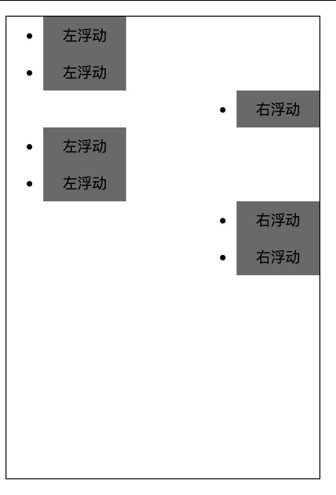


## 盒模型和边框以及边距

- **盒模型 从内到外 拥有  内容,填充, 边框, 边距** 
    - **元素内容周围最贴近的一圈叫做填充,也称内边距**
    - **包裹着填充的是 边框**
    - **边框外面包裹着的可变宽度的空白区域叫做边距**

```html
<!DOCTYPE html>
<html>
	<head>
		<meta charset="utf-8" />
		<meta name="viewport" content="width=device-width, initial-scale=1">
		<title></title>
		<style type="text/css">
			*{
				margin:  0; /* 将所有的元素 边距设置为0 */
			}
			.item {
				width: 210px; height: 136px;
				float: left;   /* 设置浮动 ,左侧 */
				margin: 20px;   /* 设置全部边距 */
				margin-top: 21px;  /* 设置顶部边距 */
			}
			#box { /* 浮动元素, 无法撑开 父元素的大小 */
				overflow: auto;   /* 将父元素的 大小变更为自动 */
				width: 750px;
				margin: auto; /* 设置父元素与网页左右两边边距相等, 这样内部元素就会自动居中 
				                 仅仅在水平方向有效*/
			}
		</style>
	</head>
	<body>
		<div id="box">
			<div class="item" style="background-image: url(img/hali1.png);"></div>
			<div class="item" style="background-image: url(img/hali2.png);"></div>
			<div class="item" style="background-image: url(img/meirenyu.png);"></div>
		</div>
	</body>
</html>
```

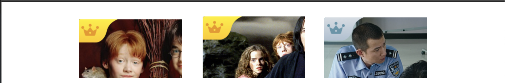

```html
<!DOCTYPE html>
<html>
	<head>
		<meta charset="utf-8" />
		<meta name="viewport" content="width=device-width, initial-scale=1">
		<title></title>
		<style type="text/css">
			*{
				margin:  0; /* 将所有的元素 边距设置为0 */
			}
			
			#box { /* 浮动元素, 无法撑开 父元素的大小 */
				overflow: auto;   /* 将父元素的 大小变更为自动 */
				width: 750px;
				margin: auto; /* 设置父元素与网页左右两边边距相等, 这样内部元素就会自动居中 
								 仅仅在水平方向有效*/
			}
		
			.item {
				
				float: left;   /* 设置浮动 ,左侧 */
				margin: 20px;   /* 设置全部边距 */
				margin-top: 21px;  /* 设置顶部边距 */
				border: 5px solid black;  /* 设置边框宽度, 样式, 颜色 */
				padding: 15px;  /* 设置内边距 */
			}
			</style>
	</head>
	<body>
		<div id="box">
			<div class="item">
				
				<br/>测试文字内容
			</div>
			<div class="item">
				
				<br/>测试文字内容
			</div>
			<div class="item">
				
				<br/>测试文字内容
			</div>
		</div>
	</body>
</html>
```


## 页面布局组合

```html
<!DOCTYPE html>
<html>
	<head>
		<meta charset="utf-8">
		<title></title>
		<style type="text/css">
			*{
				margin: 0; padding: 0;
			}
			#header {
				height: 50px;
				background-color: #FF0000;
			}
			#header .head{
				width :1005px; height: 50px;
				background: #D1D3D6;
				margin:  auto;
			}
			#banner{
				height: 500px;
				background: slateblue;
			}
			
			#category {
				width: 1005px; height: 200px;
				margin: auto;  background: #FF359A;
			}
			#category  .item{
				width: 125px; height: 165px;
				padding-left: 25px;
				padding-right: 25px;
				padding-bottom: 25px;
				padding-top: 10px;
				border-right: 1px dashed black; /*设置边框为虚线*/
				float: left; /* 浮动窗口*/
			}
			#category .item.first {
				padding-left: 0;
			}
			#category .item.last {
				padding-left: 0;
				border: 0; /* 去除延长过多的虚线 */
			}
			#case {
				height: 490px;
				background: #eeeeee;
			}
			#case .title-text{
				width: 1005px;
				margin: auto;
				padding-top: 20px;
				padding-bottom: 10px;
				font-size: 45px;
			}
			#case .item-wrapper{
				width: 1000px;
				margin: auto;
				overflow: auto;
			}
			#case .item-wrapper .item{
				width: 320px;
				height: 330px;
				background: #9ACD32;
				float: left ;
			}
				
			#case .item-wrapper .item.mg{
				margin-left: 20px;
				margin-right:20px;
			}
			#case p{
				width: 1005px;
				margin-left: auto;
				margin-right: auto;
				margin-top: 15px;
				height: 40px; line-height: 40px;
				text-align: center;
				font-size: 30px;
				color: dimgray;
			}
			
		</style>
	</head>
	<body>
		<div id="header">
			<div class="head"></div>
		</div>
		<div id="banner"></div>
		<div id="category">
			<div class="item first"></div>
			<div class="item"></div>
			<div class="item"></div>
			<div class="item"></div>
			<div class="item"></div>
			<div class="item last"></div>
		</div>
		<div id="case">
			<div class="title-text">
				Case
			</div>
			<div class="item-wrapper">
				<div class="item mg"></div>
				<div class="item"></div>
				<div class="item"></div>
			</div>
			<p>查看更多</p>
		</div>
	</body>
</html>
```

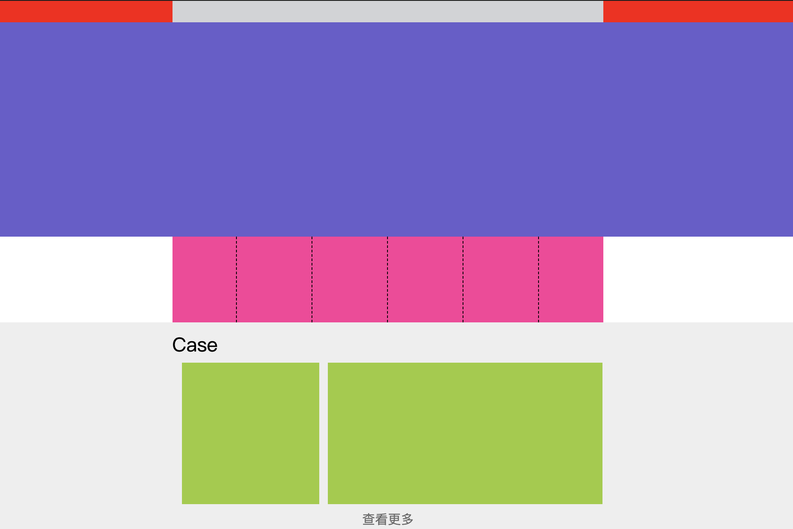


## 在HTML中使用CSS文件

```html
<link rel="stylesheet" href="styles.css" />
  rel   属性 让浏览器知道有 CSS 文档存在
  href  属性  指定 CSS 文件的位置


<!------------- 显示范例 ---------------------->
<!doctype html>
<html lang="zh">
  <head>
    <meta charset="utf-8" />
    <title>开始学习 CSS</title>
    <link rel="stylesheet" href="styles.css" />   
  </head>

  <body>
    <h1>我是一级标题</h1>

    <p>
      这是一个段落文本。在文本中有一个 <span>span element</span> 并且还有一个
      <a href="http://example.com">链接</a>.
    </p>

    <p>这是第二段。包含了一个 <em>强调</em> 元素。</p>

    <ul>
      <li>项目 1</li>
      <li>项目 2</li>
      <li>项目 <em>三</em></li>
    </ul>
  </body>
</html>

<!-- styles.css  CSS 文件内容 -->
img {
    width: 320px;
  }
p {
    color: rgb(19, 112, 234);
    font-size:large;
  }
```
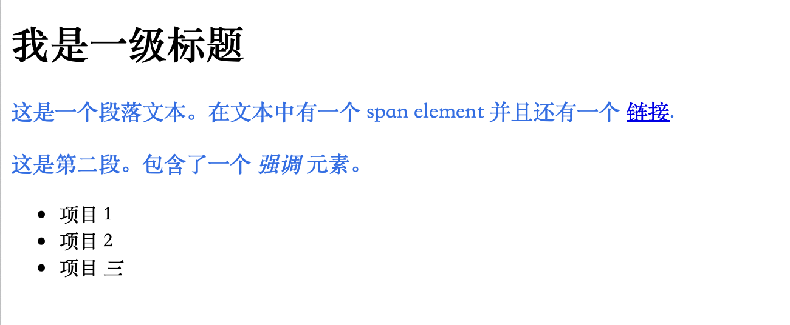

```html
更复杂的css 组合
<!doctype html>
<html lang="zh">
  <head>
    <meta charset="utf-8" />
    <title>开始学习 CSS</title>
    <link rel="stylesheet" href="styles.css" />   
  </head>

  <body>
    <h1>我是一级标题</h1>

    <p>
      这是一个段落文本。在文本中有一个 <span>span element</span> 并且还有一个
      <a href="http://example.com">链接</a>.
    </p>

    <p>这是第二段。包含了一个 <em>强调</em> 元素。</p>

    <ul>
      <li>项目 1</li>
      <li class="special">项目二</li>   <!-- 添加了class 属性， 对应的是 css文件中的 .special  内容 -->
      <li class="edRed">项目 <em>三</em></li>
    </ul>
  </body>
</html>

```

```css
<!-- styles.css css 文件 -->
/* class类属性规则, 适用于所有 class="special"  的标签 */ 
.special {
    color: orange;
    font-weight: bold;
}

/* class类属性规则, 适用于 li 和 em 两个标签下的属性， 需要这两个标签去 class 该类 
   如果其他的标签也 class 了该类， 是不会生效的。
*/ 
li.edRed,
em.edRed {
    color: red;
    font-weight:200;
}

/* 该选择器将选择<li>内部的任何<em>元素, 必须 li 嵌套 em 才可以 */
li em {
    color: rebeccapurple;
}

/* 设置出现在 h1 标签后面的 p 标签属性， 只是修改了p 标签内容 */
h1 + p {
  /* font-size: 200%; */
  color: rgb(79, 219, 209);
}

/* 当我们修改一个链接的样式时我们需要定位（针对） <a> （锚）标签。
    取决于是否是未访问的、访问过的、被鼠标悬停的、被键盘定位的，亦或是正在被点击当中的状态，这个标签有着不同的状态。
    可以使用 CSS 去定位或者说针对这些不同的状态进行修饰——下面的 CSS 代码使得没有被访问的链接颜色变为粉色、访问过的链接变为绿色。 */
a:link {  /* 未点击 */
    color: pink;
}
a:visited{ /* 点击后 */
    color: green;
}
a:hover {  /* 鼠标悬停的时候的样式，移除下划线 */
    text-decoration: none;
  }

  /*  多种组合，
    在 <body> 之内，紧接在 <h1> 后面的 <p> 元素的内部， 并且p标签需要 class="special"  */
body h1 + p .special {
  color: yellow;
  background-color: black;
  padding: 5px;
}
```
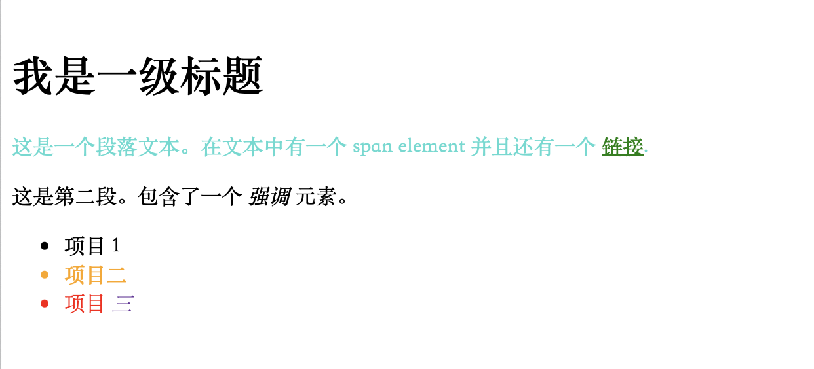


## CSS可使用的函数
### calc函数
```html
<!doctype html>
<html lang="zh-CN">
  <head>
    <meta charset="utf-8" />
    <meta name="viewport" content="width=device-width" />
    <title>我的 CSS 实验</title>
    <link rel="stylesheet" href="styles.css" />
  </head>
  <body>
    <p id="pid">在这里创建测试 HTML</p>
    <!-- <p id="pid">在这里创建测试2 HTML</p> -->
    <div class="outer" >
      <div class="box">内部盒子的宽度为 90% - 30px。</div>
    </div>
  </body>
</html>
```
```css
/* styles.css */
#pid {
    color: aquamarine;
}

p {
    color: red;
  }

.outer{
    border: 5px solid black;
}
.box{
    padding: 10px;      /* 定义元素边框与元素内容之间的空间，即上下左右的内边距。 */
    width: calc(90% - 30px);              /* 简单的计算 函数, 内部盒子的宽度 */
    background-color: rebeccapurple;   /* 背景颜色 */
    color: white;                       /* 容器内字的颜色 */
}
```

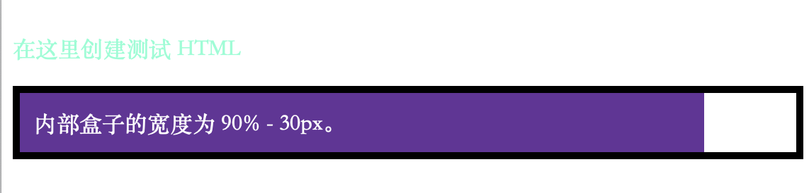


### Transform函数
```html
<!doctype html>
<html lang="zh-CN">
  <head>
    <meta charset="utf-8" />
    <meta name="viewport" content="width=device-width" />
    <title>我的 CSS 实验</title>
    <link rel="stylesheet" href="styles.css" />
  </head>
  <body>
    <p id="pid">在这里创建测试 HTML</p>
    <!-- <p id="pid">在这里创建测试2 HTML</p> -->
    <div class="outer" >
      <div class="box">内部盒子的内容</div>
    </div>
  </body>
</html>
```
```css
/* styles.css */
#pid {
    color: aquamarine;
}

p {
    color: red;
  }

.outer{
    border: 5px solid black;
}
.box{
    margin: 30px;
    width: 100px;
    height: 100px;
    background-color: rebeccapurple;
    transform: rotate(0.8turn);  /* 旋转的角度，将360度 划分为小数表示,0.25是90度 */
}
```
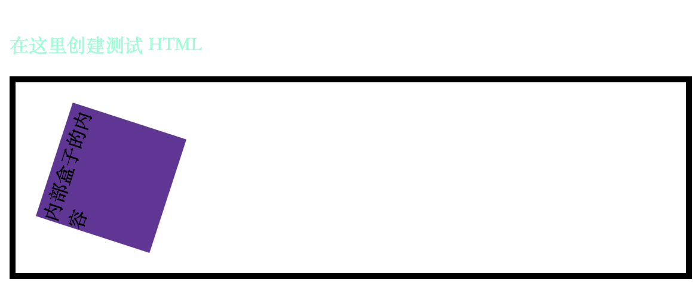

## @规则
```css
CSS 的 @rules是一些特殊的规则，提供了关于 CSS 应该执行什么或如何表现的指令。

@import "styles2.css";
	/* @import 将一个样式表导入另一个 CSS 样式表 */

@media
	/* @media 它被用来创建媒体查询 */
	/* 下面的语句会在当浏览器窗口宽度大于等于 30em 的时候 将 body 下的背景颜色都变为蓝色，否则不应用 */
	@media (min-width: 30em) {
    	body {
    	  	background-color: rgb(172, 172, 248);
    	}
  	}
```


## 层叠样式表
**层叠的表现方式是理解 CSS 的关键。**
**与层叠密切相关的概念是优先级（specificity）**
**这里也有继承的概念，也就是在默认情况下，一些 css 属性继承当前元素的父元素上设置的值，有些则不继承。这也可能导致一些和期望不同的结果。**
### 层叠
**样式表层叠——简单的说，就是 CSS 规则的顺序很重要；当应用两条同级别的规则到一个元素的时候，写在后面的就是实际使用的规则。**
```html
<h1>This is my heading.</h1>
```
```css
/* 两个关于 <h1> 的规则。<h1> 最后显示蓝色， 有相同的元素选择器，有相同的优先级 ，顺序在最后的生效 */
h1 {
  color: red;
}
h1 {  
  color: blue;
}
```

### !important特殊层叠
有一个特殊的 CSS 可以用来覆盖所有上面所有优先级计算，不过需要很小心的使用——!important。用于修改特定属性的值，能够覆盖普通规则的层叠。
```html
<p class="better">This is a paragraph.</p>
<p class="better" id="winning">One selector to rule them all!</p>
```
```css
#winning {
  background-color: red;
  border: 1px solid black;
}

.better {
  background-color: gray;
  border: none !important;
}

p {
  background-color: blue;
  color: white;
  padding: 5px;
}
```

### 优先级
浏览器是根据优先级来决定当多个规则有不同选择器对应相同的元素的时候需要使用哪个规则。它基本上是一个衡量选择器具体选择哪些区域的尺度：
- 一个元素选择器不是很具体，则会选择页面上该类型的所有元素，所以它的优先级就会低一些。
- 一个类选择器稍微具体点，则会选择该页面中有特定 class 属性值的元素，所以它的优先级就要高一点。
```html
<h1 class="main-heading">This is my heading.</h1>
```
```css
/*  <h1> 最后会显示红色——类选择器 main-heading 有更高的优先级，因此就会被应用——即使元素选择器顺序在它后面。 */
.main-heading {
  color: red;
}

h1 {
  color: blue;
}
```
### 继承
继承也需要在上下文中去理解——一些设置在父元素上的 CSS 属性是可以被子元素继承的，有些则不能。
一些属性是不能继承的——举个例子如果你在一个元素上设置 width 为 50% ，所有的后代不会是父元素的宽度的 50% 。如果这个也可以继承的话，CSS 就会很难使用了！
```html
<p>As the body has been set to have a color of blue this is inherited through the descendants.</p>
<p>We can change the color by targeting the element with a selector, such as this <span>span</span>.</p>
```
```css
body {
  color: blue;
}

span {
  color: black;
}
```

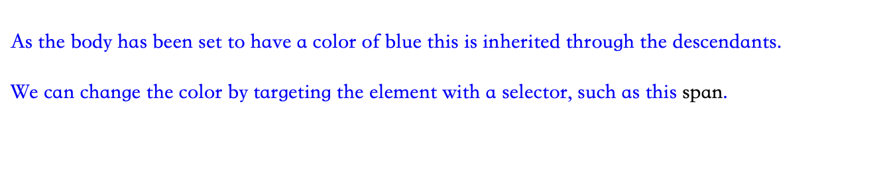

#### 继承控制
CSS 为控制继承提供了五个特殊的通用属性值。每个 CSS 属性都接收这些值。
- inherit
	- 设置该属性会使子元素属性和父元素相同。实际上，就是“开启继承”。
- initial
	- 将应用于选定元素的属性值设置为该属性的初始值。
- revert (en-US)
	- 将应用于选定元素的属性值重置为浏览器的默认样式，而不是应用于该属性的默认值。在许多情况下，此值的作用类似于 unset。
- revert-layer (en-US)
	- 将应用于选定元素的属性值重置为在上一个层叠层中建立的值。
- unset
	- 将属性重置为自然值，也就是如果属性是自然继承那么就是 inherit，否则和 initial 一样

```html
<ul>
  <li>Default <a href="#">link</a> color</li>
  <li class="my-class-1">Inherit the <a href="#">link</a> color</li>
  <li class="my-class-2">Reset the <a href="#">link</a> color</li>
  <li class="my-class-3">Unset the <a href="#">link</a> color</li>
</ul>
```

```css
body {
  color: green;
}

.my-class-1 a {
  color: inherit;
}

.my-class-2 a {
  color: initial;
}

.my-class-3 a {
  color: unset;
}
```
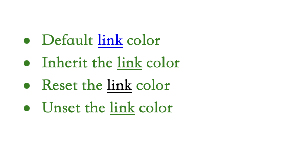


## 级联层的顺序

在级联层中声明 CSS 是，优先级的顺序由声明层的顺序来决定。在任何层之外声明的 CSS 样式会被按声明的顺序组合在一起，形成一个未命名的层，它会被当作最后声明的层。对于存在冲突的常规（没有 !important 声明）样式，后面的层比先前定义的层的优先级高。但对于带有 !important 标记的样式，其顺序相反——先前的层中的 important 样式比后面的层以及为在层中声明的 important 样式优先级要高。但内联样式比所有作者定义的样式的优先级都要高，不受级联层规则的影响。
当你在不同的层中有多个样式块，且其中提供了对于某一元素的单一属性的相互冲突的值时，声明该冲突样式的层的顺序将决定其优先级。而不是高优先级的层直接覆盖低优先级的层中的所有样式。需要注意的是单独的一个层中的样式的优先级仍旧会起作用。

```html
    <p id="addSpecificity">
      A paragraph with a border and background
    </p>
```
```css
@layer firstLayer, secondLayer;
/* 这两个@layer 定义的涂层都被覆盖和忽略了
   起作用的是p 和 P#addSpecificity
*/

p { /* 0-0-1 */
  background-color: red;
  color: grey !important;
  border: 5px inset purple;
}
p#addSpecificity { /* 1-0-1 */
  border-style: solid !important;
  font-size: 30px;
}
/* 
@layer 是 Sass 中的一个标识符，用于定义样式图层。首先，Sass 是一种用于生成 CSS 的预处理器，它有助于更有效地编写样式表。
@layer firstLayer 表示将当前的样式规则放置在名为 firstLayer 的图层中。
@layer 是 Sass 中的特定功能，需要在编译成普通的 CSS 之前进行处理。
 */
@layer firstLayer {
  #addSpecificity { /* 1-0-0 */
    background-color: blue;
    color: white !important;
    border-width: 5px;
    border-style: dashed !important;
  }
}

@layer secondLayer {
  p#addSpecificity { /* 1-0-1 */
    background-color: green;
    color: orange !important;
    border-width: 10px;
    border-style: dotted !important;
  }
}
```
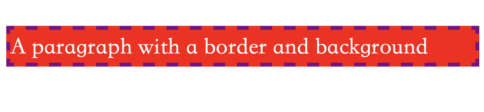


## 盒模型
在 CSS 中，所有的元素都被一个个的“盒子（box）”包围着，理解这些“盒子”的基本原理，是我们使用 CSS 实现准确布局、处理元素排列的关键。

### 块级盒子和内联盒子
块级盒子（Block box）和 内联盒子（Inline box），这两种盒子会在页面流（page flow）和元素之间的关系方面表现出不同的行为：
- 一个被定义成块级的（block）盒子会表现出以下行为：
	- 盒子会在内联的方向上扩展并占据父容器在该方向上的所有可用空间，在绝大数情况下意味着盒子会和父容器一样宽每个盒子都会换行
	- width 和 height 属性可以发挥作用
	- 内边距（padding）, 外边距（margin）和 边框（border）会将其他元素从当前盒子周围“推开”
	- 除非特殊指定，诸如标题 (<h1>等) 和段落 (<p>) 默认情况下都是块级的盒子。
- 如果一个盒子对外显示为 inline，那么他的行为如下：
	- 盒子不会产生换行。
	- width 和 height 属性将不起作用。
	- 垂直方向的内边距、外边距以及边框会被应用但是不会把其他处于 inline 状态的盒子推开。
	- 水平方向的内边距、外边距以及边框会被应用且会把其他处于 inline 状态的盒子推开。
	- 用做链接的 <a> 元素、 <span>、 <em> 以及 <strong> 都是默认处于 inline 状态的。
- **我们通过对盒子display 属性的设置，比如 inline 或者 block ，来控制盒子的外部显示类型。**

### 内部和外部显示类型
css 的 box 模型有一个外部显示类型，来决定盒子是块级还是内联。

同样盒模型还有内部显示类型，它决定了盒子内部元素是如何布局的。默认情况下是按照 **正常文档流 **布局，也意味着它们和其他块元素以及内联元素一样 (如上所述).

但是，我们可以通过使用类似 flex 的 display 属性值来更改内部显示类型。如果设置 display: flex，在一个元素上，外部显示类型是 block，但是内部显示类型修改为 flex。该盒子的所有直接子元素都会成为 flex 元素，会根据弹性盒子（Flexbox）规则进行布局，稍后你将了解这些规则。
当你进一步了解 css 布局的更多细节的时候，你会了解到 flex，和其他内部显示类型会用到的值，例如 grid 。

块级和内联布局是 web 上默认的行为——正如上面所述，它有时候被称为 正常文档流，因为如果没有其他说明，我们的盒子布局默认是块级或者内联。

### 不同显示类型的例子
下面三个 html 元素，都有一个外部显示类型 block。第一个是一个段落，在 CSS 中加了边框。浏览器把它渲染成一个块级盒子，所以段落从新的一行开始，而且宽度占满一行。

第二个是一个列表，布局属性是 display: flex。将在容器中建立一个 flex 布局，但是每个列表是一个块级元素——像段落一样——会充满整个容器的宽度并且换行。

下面有个块级段落，里面有两个 <span> 元素。正常情况下是 inline，但是其中一个加了 block 类，设置属性 display: block。

```html
    <p>I am a paragraph. A short one.</p>
    <ul>
      <li>Item One</li>
      <li>Item Two</li>
      <li>Item Three</li>
    </ul>
    <p>I am another paragraph. Some of the 
      <span class="block">words</span> 
      have been wrapped in a 
      <span>span element</span>
      .</p>
```
```css
p,
ul {
  border: 2px solid rebeccapurple;
  padding: .5em;
}

.block,
li {
  border: 2px solid blue;
  padding: .5em;
}

ul {
  display: flex;
  list-style: none;
}

.block {
  display: block;
}
```
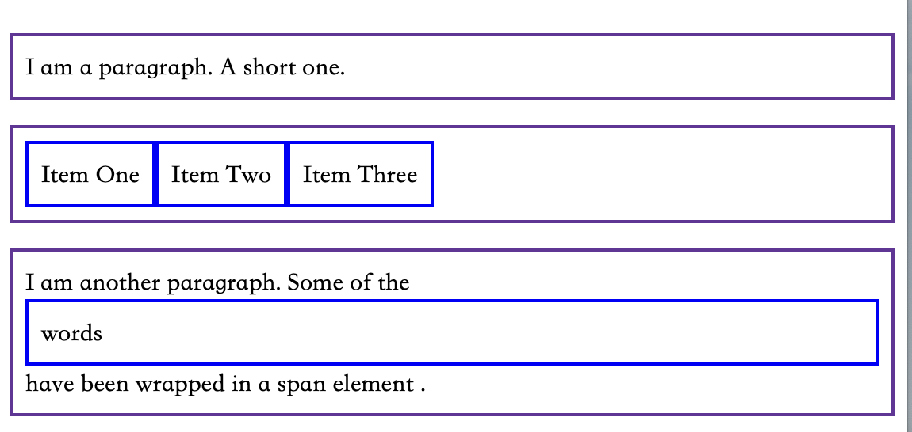

**可以修改 display: inline 为 display: block 或者 display: inline-flex 改为 display: flex 来观察显示模式切换。**
```html
    <p>
      I am a paragraph. Some of the
      <span>words</span> have been wrapped in a
      <span>span element</span>.
    </p>
    <ul>
      <li>Item One</li>
      <li>Item Two</li>
      <li>Item Three</li>
    </ul>
    <p class="inline">I am a paragraph. A short one.</p>
    <p class="inline">I am another paragraph. Also a short one.</p>
```

```css
p,
ul {
  border: 2px solid rebeccapurple;
}

span,
li {
  border: 2px solid blue;
}

ul {
  display: inline-flex;
  list-style: none;
  padding: 0;
}

.inline {
  display: inline;
}
```

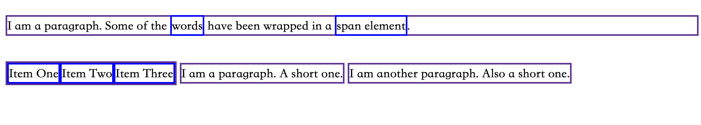


