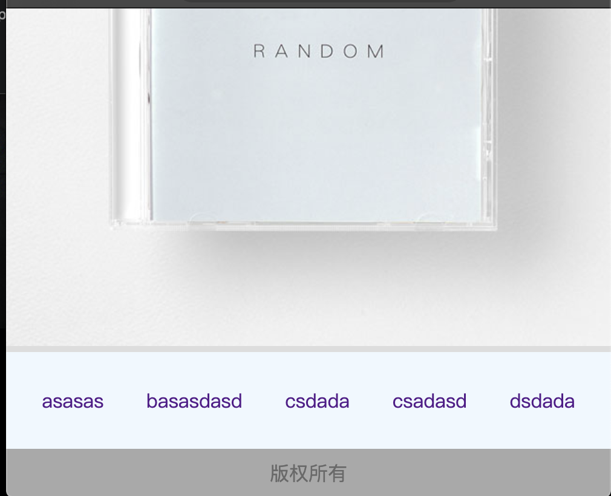

**`CSS (Cascading style sheet)` 层叠样式表, 修饰网页样式的语法**

## 目录

- [样式属性](#样式属性)
- [内部样式表和css选择器](#内部样式表和css选择器)
    - [CSS选择器属性和优先级判断](#CSS选择器属性和优先级判断)
- [CSS文本属性样式](#CSS文本属性样式)
- [背景图的使用以及常见的图片格式](#背景图的使用以及常见的图片格式)
- [元素浮动](#元素浮动)
- [盒模型和边框以及边距](#盒模型和边框以及边距)
    - [页面布局组合](#页面布局组合)
    - 


## 样式属性

```html
<input type="submit" value="提交" style="width: 80px; height: 30px; background-color: #E06C75 ;" />
<!-- style是样式设置属性,   上面有设置了 宽度80px, 高度 30px, 背景颜色 -->
```


## 内部样式表和css选择器

- **写在普通标签内的样式  `style属性` , 称为 行内样式**
- **写在 `style标签` 内的样式属性,称为 内部样式**
- **行内样式 优先级大于 内部样式的优先级**,  
    - 当行内和内部 样式都设置了同一种属性, 那么只有行内样式的那个属性生效. 
    - 其他的属性则不影响

```html
<!-- 设置所有标签a, 也就是超链接的 标签属性 -->
<!-- 这个 a{} 被称为标签选择器, 他选择了让页面所有的 这个标签拥有这个属性 -->
<!-- #banner 代表  <div id="ndiv"></div> ,中的id号, 用来区分针对某个容器的属性设置,也就是ID选择器 -->
<!-- 让标签用 class 属性,来进行类别的区分, 分门归类, 会让同一类别的标签拥有 同一个 style标签 中的属性
       a超链接标签拥有 标签选择器的属性, 也有 .nav类别的属性, 那么页面所有a标签都拥有 标签选择器的属性
       只有 class="nav" 的a标签 才会拥有 标签选择器和.nav列表 两者相加的属性-->

<!-- #banner img { width: 100%; }  表示存在于 id="banner" 的容器内的 img标签才会拥有这个属性 
                    .类别也可以这么写,   .nav img {width: 100%; } -->
<!-- 连起来,  类选择器  .a.b {}    , id选择器  #id .a.b{}  , 这样来组合, 小心空格-->

<!DOCTYPE html>
<!-- 对html 进行修改,会影响整个页面的背景颜色 -->
<html >
	<head>
		<meta charset="utf-8">
		<title></title>
 <!-- 标签名: css选择器, #ID名 : id选择器,  .类名: class选择器 -->
		<style>
			html { background-color: #ddd;}
			body { margin: 0px; }
			a    {  text-decoration: none;  margin: 0 15px; }
			
			#banner { width:100%; }
			#navigation { text-align: center; height: 80px ; line-height: 80px; background-color: aliceblue; }
			#buttom { text-align: center; height: 40px; line-height: 40px; background-color: darkgrey; font-size: 16px; color: dimgrey; }
			
			.nav {   color: black; }
			
			#banner img { width: 100%; }
		</style>
	</head>
	<!-- 将网页两侧的一小些空白去掉, 这个是body产生的 -->
	<body>
		
		<!-- banner 横幅, 设置图片放大到原尺寸-->
		<div id="banner">
			
		</div>
			
		<!-- navigation 导航, 字体默认占用16px, 修改 行高 与高度相等 就可以让文字居中和垂直-->
		<div id="navigation" >
			   <!-- style="margin: 0 15px; 设置文本的上下距离为0, 左右距离为15px -->
               <!-- text-decoration: none; 是去掉下划线 属性 -->
			<a href="../index.html" calss="nav"> asasas </a>
			<a href="../index.html" calss="nav"> basasdasd </a>
			<a href="../index.html" calss="nav"> csdada </a>
			<a href="../index.html"> csadasd </a>
			<a href="../index.html"> dsdada </a>
		</div>
			
		<!-- butten 底部 -->
		<div id="buttom" >
			版权所有
		</div>
		
	</body>
</html>
```




### CSS选择器属性和优先级判断

- **css选择器属性:**
    - **ID选择器 不可以重名( `<style> #banner{ background-color: #ddd;} </style>`)**
    - **标签选择器 根据标签名来选择相对的属性( `<style> html { background-color: #ddd;} </style>`)**
    - **类别选择器,拥有该类别class的多个元素( `<style> .dav { background-color: #ddd;} </style>`)**
        - 同一个标签 可以拥有多个 class类名, `<a class="one two"></a>`
    - **通用选择器,针对页面所有标签( `<style> * { background-color: #ddd;} </style>`)**
- 选择器也有优先级( 如果出现嵌套就不一定了)
    - **通用  < 标签  < Class < ID  < 行内样式**
- **也可以通过权重值来进行计算优先级和生效的属性, 权重最高的会生效**
    - `*`**通用选择器, 权重0**
    - `p, div` **标签(元素)选择器, 权重 1**
    - `.pid` **类(别)选择器, 权重10** 
    - `#pid` **ID选择器, 权重 100**
    - `stple=""` **行内样式, 权重1000**
- **选择器选择的范围越小 越精确, 优先级就越高**

```html
<!DOCTYPE html>
<html>
	<head>
		<meta charset="utf-8">
		<title></title>
		<style type="text/css">
			p {color: yellow;}
			div p{color : green; }
			.demo p{color: black;}
			#demo p{color: orange;}
			div #demo p{color: gray;}
		</style>
	</head>	
	<body>
		<p >猜颜色 class="demo"</p>
	<div><p >猜颜色 class="demo"</p></div>
	<div class="demo">
		<p >猜颜色 class="demo"</p>
	</div>
	<div id="demo">
		<p  >猜颜色  id="demo"</p>
	</div>
	</body>
</html>
```


## CSS文本属性样式

> **CSS文本属性:   颜色, 字体, 行高, 大小, 加粗, 倾斜, 首行缩紧, 水平对齐, 文字修饰**

```html
<!DOCTYPE html>
<html>
	<head>
		<meta charset="utf-8">
		<title></title>
		<style style="text/css">
			 .p1 {color: red;}    /* 颜色 */
			 .p2 {font-family: "monaco"; }  /* 字体  */
			 .p3 {font-size: 26px;}     /* 字号 */
			 .p4 {font-weight: bold;}   /* 加粗 */
			 .p5 {font-style: italic; }   /* 文字倾斜 */
			 .p6 {text-indent: 60px;}   /* 首行缩紧*/
			 .p7 {text-align: center;}   /* 水平对齐方式,居中 */
			 .p8 {line-height: 100px;}  /* 行高 */
			 .p9 {height: 100px ; line-height: 100px;background-color: gray;}  /* 垂直居中,同时设置行的高度和字的高度,设置背景颜色 */
			 .p10 { text-decoration: underline;}  /* 文本修饰,只是给文字增加了下划线 */ 
		</style>
	</head>
	<body>
		<ul>
			<li class="p1" >aaaaaaaaaaaaaaaaaaaa</li>
			<li class="p2">bbbbbbbbbbbbbbbbbbbb</li>
			<li class="p3">cccccccccccccccccccc</li>
			<li class="p4" >dddddddddddddddddddd</li>
			<li class="p5">eeeeeeeeeeeeeeeeeeee</li>
			<li class="p6">ffffffffffffffffffff</li>
			<li class="p7">gggggggggggggggggggg</li>
			<li class="p8">hhhhhhhhhhhhhhhhhhhh</li>
			<li class="p9">iiiiiiiiiiiiiiiiiiii</li>
			<li class="p10">jjj撒打算打算jjjjjjjjjjjjjjjjj</li>
		</ul>
	</body>
</html>
```


## 背景图的使用以及常见的图片格式

- **gif**
    - **支持动画**
    - 只有全透明和不透明两种模式
    - 只有256种颜色,无法保存色彩较为丰富的照片
- **jpg**
    - 有损压缩算法
    - 体积较小
    - 不支持透明
    - **不支持动画**
- **png(使用最多)**
    - **采用无损压缩算法**
    - 体积相对较小
    - 支持背景透明
    - **不支持动画**
- **svg**
    - 不会失真的图片
    - 它是一串代码,记录这图片的矢量信息
    - **保存颜色和形状丰富的照片 体积会大的惊人**

```html
<!DOCTYPE html>
<html>
	<head>
		<meta charset="utf-8">
		<title></title>

	</head>
	<style type="text/css">
		html,body {
			margin: 0;    /* 去除网页周围的滚动条 */
			height: 100%;  /* 让body 与 html 的高宽相同 */
		}
		body {
			background-image: url(img/5_60x60.png);
			background-repeat: no-repeat;   /* 不让背景图进行平铺 */
			background-position: center center;   /* 让背景图片 居中显示 */
		}
	</style>
	<body></body>
</html>
```


## 元素浮动

- **浮动元素会脱离网页文档, 与其他元素发生重叠, 不会与文字内容发生重叠,而是会将文字挤走**
- **浮动元素不会撑开父容器的大小. 因为是浮动的**
    - **所以父元素必须设置大小**
    - 或者给父元素增加属性 `clear: both;` 或 `clear: left` 不受左右浮动影响, 和单独的左浮动影响
- **浮动元素排列的时候, 只参考前一个元素的位置即可**
- **浮动元素的重叠问题**
    - 浮动元素不会覆盖文字内容
    - 浮动元素不会覆盖图片内容
        - 图片本身也属于文本, 可以把图片看成是一个特殊的文字
    - 浮动元素不会覆盖表单元素
        - 输入框, 单选按钮, 复选框, 按钮, 下拉选择框等.

```html
<!DOCTYPE html>
<html>
	<head>
		<meta charset="utf-8">
		<title></title>
	</head>
	<style type="text/css">
		.a { width: 20% ;background-color: orangered;
		}
		.b {width: 60% ;background-color: green;
		}
		.c {width: 20% ;background-color: blue;
		}
		.a,.b,.c{ height: 200px;  float: left;}
		.hh {height: 360px; background-color: #808080;}
		.outer {height: 200px; clear: both;}
	</style>
	<body>
		<div class="outer">
			<div class="a"></div>
			<div class="b"></div>
			<div class="c"></div>
		</div>
		<div class="hh"></div>
	</body>
</html>

```


```html
<!-- 一个页面窗口 -->
<!DOCTYPE html>
<html>
	<head>
		<meta charset="utf-8">
		<title></title>
	</head>
	<style type="text/css">
		ul {
			/* background-color: green; */
			width: 300px; height: 500px;
			clear: both;
			border-width: 1px;   /* 边框的宽度 */
			border-style: solid;  /* 显示边框 */
			border-color: black;   /*容器内文字的颜色 */
		}
		
		.l {
			float: left;
		}
		.r {
			float: right;
		}
		.l,.r{			
			width: 30%;
			line-height: 40px;
			height: 40px;
			text-align: center;
			clear: both;
			background-color: #696969;}
	</style>
	<body>
			<div>
				<ul> 
				<li class="l">左浮动 </li>
				<li class="l">左浮动</li>
				<li class="r">右浮动</li>
				<li class="l">左浮动</li>
				<li class="l">左浮动</li>
				<li class="r">右浮动</li>
				<li class="r">右浮动</li>
				</ul>
			</div> 
	</body>
</html>
```


## 盒模型和边框以及边距

- **盒模型 从内到外 拥有  内容,填充, 边框, 边距** 
    - **元素内容周围最贴近的一圈叫做填充,也称内边距**
    - **包裹着填充的是 边框**
    - **边框外面包裹着的可变宽度的空白区域叫做边距**

```html
<!DOCTYPE html>
<html>
	<head>
		<meta charset="utf-8" />
		<meta name="viewport" content="width=device-width, initial-scale=1">
		<title></title>
		<style type="text/css">
			*{
				margin:  0; /* 将所有的元素 边距设置为0 */
			}
			.item {
				width: 210px; height: 136px;
				float: left;   /* 设置浮动 ,左侧 */
				margin: 20px;   /* 设置全部边距 */
				margin-top: 21px;  /* 设置顶部边距 */
			}
			#box { /* 浮动元素, 无法撑开 父元素的大小 */
				overflow: auto;   /* 将父元素的 大小变更为自动 */
				width: 750px;
				margin: auto; /* 设置父元素与网页左右两边边距相等, 这样内部元素就会自动居中 
				                 仅仅在水平方向有效*/
			}
		</style>
	</head>
	<body>
		<div id="box">
			<div class="item" style="background-image: url(img/hali1.png);"></div>
			<div class="item" style="background-image: url(img/hali2.png);"></div>
			<div class="item" style="background-image: url(img/meirenyu.png);"></div>
		</div>
	</body>
</html>
```


```html
<!DOCTYPE html>
<html>
	<head>
		<meta charset="utf-8" />
		<meta name="viewport" content="width=device-width, initial-scale=1">
		<title></title>
		<style type="text/css">
			*{
				margin:  0; /* 将所有的元素 边距设置为0 */
			}
			
			#box { /* 浮动元素, 无法撑开 父元素的大小 */
				overflow: auto;   /* 将父元素的 大小变更为自动 */
				width: 750px;
				margin: auto; /* 设置父元素与网页左右两边边距相等, 这样内部元素就会自动居中 
								 仅仅在水平方向有效*/
			}
		
			.item {
				
				float: left;   /* 设置浮动 ,左侧 */
				margin: 20px;   /* 设置全部边距 */
				margin-top: 21px;  /* 设置顶部边距 */
				border: 5px solid black;  /* 设置边框宽度, 样式, 颜色 */
				padding: 15px;  /* 设置内边距 */
			}
			</style>
	</head>
	<body>
		<div id="box">
			<div class="item">
				
				<br/>测试文字内容
			</div>
			<div class="item">
				
				<br/>测试文字内容
			</div>
			<div class="item">
				
				<br/>测试文字内容
			</div>
		</div>
	</body>
</html>
```


## 页面布局组合

```html
<!DOCTYPE html>
<html>
	<head>
		<meta charset="utf-8">
		<title></title>
		<style type="text/css">
			*{
				margin: 0; padding: 0;
			}
			#header {
				height: 50px;
				background-color: #FF0000;
			}
			#header .head{
				width :1005px; height: 50px;
				background: #D1D3D6;
				margin:  auto;
			}
			#banner{
				height: 500px;
				background: slateblue;
			}
			
			#category {
				width: 1005px; height: 200px;
				margin: auto;  background: #FF359A;
			}
			#category  .item{
				width: 125px; height: 165px;
				padding-left: 25px;
				padding-right: 25px;
				padding-bottom: 25px;
				padding-top: 10px;
				border-right: 1px dashed black; /*设置边框为虚线*/
				float: left; /* 浮动窗口*/
			}
			#category .item.first {
				padding-left: 0;
			}
			#category .item.last {
				padding-left: 0;
				border: 0; /* 去除延长过多的虚线 */
			}
			#case {
				height: 490px;
				background: #eeeeee;
			}
			#case .title-text{
				width: 1005px;
				margin: auto;
				padding-top: 20px;
				padding-bottom: 10px;
				font-size: 45px;
			}
			#case .item-wrapper{
				width: 1000px;
				margin: auto;
				overflow: auto;
			}
			#case .item-wrapper .item{
				width: 320px;
				height: 330px;
				background: #9ACD32;
				float: left ;
			}
				
			#case .item-wrapper .item.mg{
				margin-left: 20px;
				margin-right:20px;
			}
			#case p{
				width: 1005px;
				margin-left: auto;
				margin-right: auto;
				margin-top: 15px;
				height: 40px; line-height: 40px;
				text-align: center;
				font-size: 30px;
				color: dimgray;
			}
			
		</style>
	</head>
	<body>
		<div id="header">
			<div class="head"></div>
		</div>
		<div id="banner"></div>
		<div id="category">
			<div class="item first"></div>
			<div class="item"></div>
			<div class="item"></div>
			<div class="item"></div>
			<div class="item"></div>
			<div class="item last"></div>
		</div>
		<div id="case">
			<div class="title-text">
				Case
			</div>
			<div class="item-wrapper">
				<div class="item mg"></div>
				<div class="item"></div>
				<div class="item"></div>
			</div>
			<p>查看更多</p>
		</div>
	</body>
</html>
```


