## 目录

- [骨架](#骨架)
- [转义字符](#转义字符)
- [HTML头](#HTML头)
- [排版标签](#排版标签)
    - [h1标题标签](h1标题标签)
    - [ul有序和ol无序列表标签](#ul有序和ol无序列表标签)
    - [center,em,strong,del,ins等文字样式标签](#center,em,strong,del,ins等文字样式标签)
    - [p段落标签](#p段落标签)
    - [hr水平线标签](#hr水平线标签)
    - [br换行标签](#br换行标签)
    - [code展示代码](#code展示代码)
    - [time标记时间和日期](#time标记时间和日期)
- [a超链接标签](#a超链接标签)
    - [a下载链接download属性](#a下载链接download属性)
    - [a电子邮件链接mailto属性](#a电子邮件链接mailto属性)
- [img图片标签](#img图片标签)
- [table表格标签](#table表格标签)
    - [col设置一列数据显示格式](#col设置一列数据显示格式)
    - [colgroup设置一组数据显示格式](#colgroup设置一组数据显示格式)
    - [tr表格中的行](#tr表格中的行)
    - [td行中的列](#td行中的列)
    - [th行中的列,简化](#th行中的列,简化)
- [input输入框或按钮,提交表单案例,有form标签](#input输入框或按钮,提交表单案例,有form标签)
    - [get请求和post请求,提交数据和获取数据的表单补充内容](#get请求和post请求,提交数据和获取数据的表单补充内容)
- [span容器和div容器标签](#span容器和div容器标签)
- [video视频元素标签](#video视频元素标签)
- [audio音频元素标签](#audio音频元素标签)
- [iframe嵌入式标签](#iframe嵌入式标签)
- [emdeb和object通用嵌入工具标签](#emdeb和object通用嵌入工具标签)
- [svg矢量图标记](#svg矢量图标记)
- [HTML布局元素细节](#HTML布局元素细节)


## 骨架

```html
<!DOCTYPE html>     <!-- 声明使用的html 版本. 写在 <html> 标签之前 -->
<html lang="zh-Hans">     <!--语言标签解释 为简体中文 -->
	<meta charset="UTF-8" />     <!-- 声明使用的 unicode  UTF-8 字符集,写在紧挨着 html 那里-->      
    <head> </head>    <!-- 头标签 用于存放:  title , mete , base,  style ,script ,link  -->
    <body>    <!-- 主体 -->
       <title> 标签 标题 </title>
       <table>
      		 <col/>
           <colgroup>
          	  <tr>
               	<td> <input /> </td>
                <th></th>
              </tr>
            </colgroup>
          </table>
				<a>  </a>
    </body>
</html>
```

- **`html`** 标签  ,  **根标签**
    - 所有 html 中标签的一个根节点.
- **`head`** 标签 ,  **头标签**
    - 用于存放:  title , mete , base,  style ,script ,link 
- **`title`**  标签 ,  **标题标签, (显示到浏览器标签部分)**
    - 让页面拥有一个属于自己的标题
- **`body`** 标签,  **主体标签**
    - 页面的主体部分, 用于存放所有的 html 标签.


## 转义字符

```html
&nbsp;     <!-- 网页上显示一个空格 是 html的空格转义字符 -->
```


## HTML头

```html
<!doctype html>
<html lang="zh-CN">  <!-- 为文档设定主语言 -->
  <head>
    <meta charset="utf-8" /> <!-- 指定文档的字符编码 -->
		<meta
			  name="description"
			  content="The MDN Web Docs Learning Area aims to provide
						complete beginners to the Web with all they need to know to get
						started with developing web sites and applications." 
    />  <!-- name 属性 指定了 meta 元素的类型；说明该元素包含了什么类型的信息。 -->
				<!-- content 属性 指定了实际的元数据内容， 内容可以在搜索引擎中搜到 -->
    
    <meta
      property="og:image"
      content="https://developer.mozilla.org/mdn-social-share.png" />
    <meta
      property="og:description"
      content="The Mozilla Developer Network (MDN) provides and HTML Apps." />
		<meta property="og:title" content="Mozilla Developer Network" />
    <!-- property="og:image" 属性会在搜索引擎中展示一张图片 -->
    <!-- content="https://developer.mozilla.org/mdn-social-share.png" 配合的图片路径 -->
    
    
    
    <title>我的测试页面</title>	<!-- 页面标题 -->
	  <link rel="icon" href="favicon.ico" type="image/x-icon" />	 <!-- 加载图标文件 -->
		<link rel="stylesheet" href="my-css-file.css" />	<!-- 加载 css -->
	  <script src="my-js-file.js" defer></script>  <!-- 加载 javaScript -->
    </head>
</html>
```


下面是搜索引擎边界面上出现的图片内容


## 排版标签

### h1标题标签

```html
<h1 align="center"> ... </h1>  <!-- 标题标签  最大, 没有特殊符号, 后面属性代表居中显示-->
<h6> ... </h6>  <!-- 标题标签  最小, 没有特殊符号-->

<!-------------------- 显示效果 ------------------------------------------->
<!DOCTYPE html> 
<html lang="zh-Hans">
  <meta charset="UTF-8" />
  <head> <titele> 标签 </titele> </head>
  <doby>
    <h1>最大的标签</h1>
    <h6>最小的标签</h6>
  </doby>
</html>
```

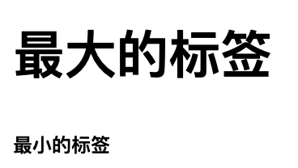


### ul有序和ol无序列表标签

```html
<ul> <li> 列表项目 </li> </ul>  <!-- ul 这只个列表,是无序列表,前面只有个实心圆.里面需要列表项进行填充 -->
<ol> <li> 列表项目 </li> </ol>  <!-- ul 这只个列表,是有序列表,前面有数字来显示.里面需要列表项进行填充 -->

<!-------------------- 显示效果 ------------------------------------------->
<!DOCTYPE html>
<html lang="zh-Hans">
  <meta charset="UTF-8" />
  <head> <title> ul , li </title>  </head>
  <body>
    <ul> <li> 列表1</li> </ul>
    <ol> <li> 列表2</li> </ol>
  </body>
</html>
```

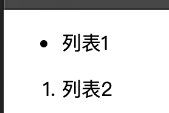


### center,em,strong,del,ins等文字样式标签

```html
<center> ... </center>  <!-- 居中效果 -->
<em> ... </em>          <!-- 文字以 斜体 方式显示 -->
<strong> ... </strong>  <!-- 文字以 粗体 的方式显示 -->
<del> ... </del>        <!-- 文字以加 删除线 方式显示 -->
<ins> ... </ins>        <!-- 文字以 加下划线 方式显示 -->

<!-------------------- 显示效果 ------------------------------------------->
<!DOCTYPE html>
<html>
  <meta charset="UTF-8" />
  <head> <title> center,em,strong,del,ins </title>  </head>
  <body> 
    <ul> <li> <center><strong><em>居中加粗和斜体 </em></strong>  </center> </li> </ul>
    <ol> <li> <del> <ins> >删除线和下划线  </ins></del> </li> </ol>
  </body>
</html>
```

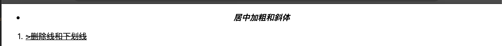


### p段落标签

```html
<p> ... </p>     <!--段落标签, 文字会独占一行 , 跟换行符差不多--> 

<!-- p标签是   paragraph 的缩写-->
```


### hr水平线标签

```html
<hr/>            <!-- 水平线-->
<hr color="yellow" />    <!-- 设置颜色-->

<!-- hr 是 horizontal 横线的缩写,  是单标签-->

<!-------------------- 显示效果 ------------------------------------------->
<!DOCTYPE html>
<html lang="zh-Hans">
	<meta charset="UTF-8" />
	<head> 
		<title>hello</title>
	</head>
	<body>
		<hr color="red" />	<p>这是第一段</p>  <hr color="yellow" /> <hr color="purple" />
		<hr color="green" />
	</body>
</html>
```

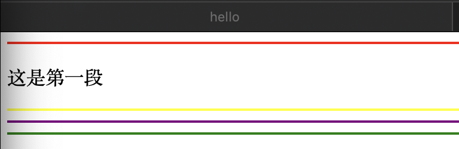


### br换行标签

```html
<br/>            <!-- 换行标记 , 文字会换行-->
<!-- br 是 break 打断,换行 的缩写,是单标签 -->
```


### code展示代码

- `<code>` :用于标记计算机通用代码。
- `<pre>`：用于保留空白字符（通常用于代码块）——如果文本中使用了缩进或多余的空白，浏览器将忽略它，你将不会在呈现的页面上看到它。但是，如果你将文本包含在 `<pre></pre>` 标签中，那么空白将会以与你在文本编辑器中看到的相同的方式渲染出来。
- `<var>`：用于标记具体变量名。
- `<kbd>`：用于标记输入电脑的键盘（或其他类型）输入。
- `<samp>`：用于标记计算机程序的输出。

```html
<pre><code>const para = document.querySelector('p');

para.onclick = function() {
  alert('噢，噢，噢，别点我了。');
}</code></pre>

<p>
  请不要使用 <code>&lt;font&gt;</code> 、
  <code>&lt;center&gt;</code> 等表象元素。
</p>

<p>在上述的 JavaScript 示例中，<var>para</var> 表示一个段落元素。</p>

<p>按 <kbd>Ctrl</kbd>/<kbd>Cmd</kbd> + <kbd>A</kbd> 选择全部内容。</p>

<pre>$ <kbd>ping mozilla.org</kbd>
<samp>PING mozilla.org (63.245.215.20): 56 data bytes
64 bytes from 63.245.215.20: icmp_seq=0 ttl=40 time=158.233 ms</samp></pre>

<!-------------------- 显示效果 ------------------------------------------->

<!DOCTYPE html>
<html lang="zh-CN">
  <head>
    <meta charset="utf-8">
    <meta name="viewport" content="width=device-width">
    <title>My test page</title>
  </head>
  <body>


<pre><code>const para = document.querySelector('p');

para.onclick = function() {
  alert('噢，噢，噢，别点我了。');
}</code></pre>

<p>
  请不要使用 <code>&lt;font&gt;</code> 、
  <code>&lt;center&gt;</code> 等表象元素。
</p>

<p>在上述的 JavaScript 示例中，<var>para</var> 表示一个段落元素。</p>

<p>按 <kbd>Ctrl</kbd>/<kbd>Cmd</kbd> + <kbd>A</kbd> 选择全部内容。</p>

<pre>$ <kbd>ping mozilla.org</kbd>
<samp>PING mozilla.org (63.245.215.20): 56 data bytes
64 bytes from 63.245.215.20: icmp_seq=0 ttl=40 time=158.233 ms</samp></pre>
  </body>
</html>
```


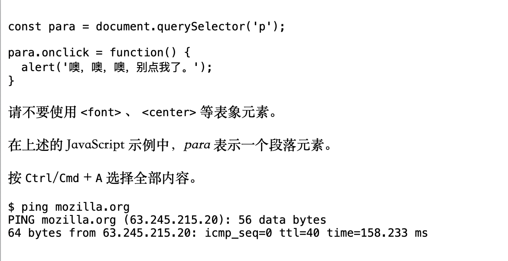

### time标记时间和日期

```html
<time datetime="2016-01-20">2016 年 1 月 20 日</time>

<!-------------------- 显示效果 ------------------------------------------->
<!DOCTYPE html>
<html lang="zh-CN">
  <head>
    <meta charset="utf-8">
    <meta name="viewport" content="width=device-width">
    <title>My test page</title>
  </head>
  <body>


<!-- 标准简单日期 -->
<p><time datetime="2016-01-20">20 January 2016</</time></p>
<!-- 只包含年份和月份-->
<p><time datetime="2016-01">January 2016</</time></p>
<!-- 只包含月份和日期 -->
<p><time datetime="01-20">20 January</</time></p>
<!-- 只包含时间，小时和分钟数 -->
<p><time datetime="19:30">19:30</</time></p>
<!-- 还可包含秒和毫秒 -->
<p><time datetime="19:30:01.856">19:30:01.856</</time></p>
<!-- 日期和时间 -->
<p><time datetime="2016-01-20T19:30">7.30pm, 20 January 2016</</time></p>
<!-- 含有时区偏移值的日期时间 -->
<p><time datetime="2016-01-20T19:30+01:00">7.30pm, 20 January 2016 is 8.30pm in France</</time></p>
<!-- 提及特定周 -->
<p><time datetime="2016-W04">The fourth week of 2016</</time></p>

<p><time datetime="2016-01-20">2016 年 1 月 20 日</time></p>

  </body>
</html>
```

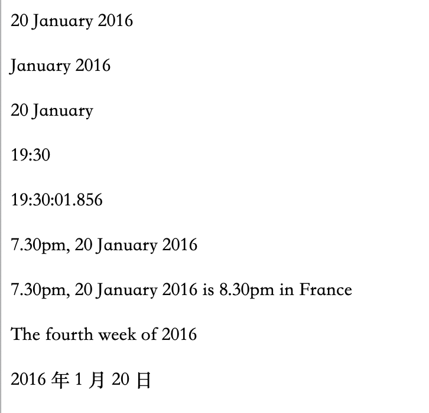


## a超链接标签

```html
<!-- 超链接  , 可以嵌套图片, 文本,等很多内容 -->
<a href="链接地址" target="_blank" style="text-decoration: none;margin: 0 15px color: black;"  title="鼠标指向时显示的内容" > 文本或图链接说明
</a>   
   <!-- target表示目标地址,可以是目录 也可以是某个网址 -->
   <!-- _blank参数表示空白, 代表在空白新窗口打开链接地址页面,没有该参数就在当前页面跳转 -->
   <!-- 嵌套图片的话, 就要写上  标签了
   <!-- style="margin: 0 15px;"   设置文本的上下距离为0, 左右距离为15px -->
   <!-- style="text-decoration: none;"    取消超链接底部的下下划线 -->
   <!-- border-right: solid 1px #808080; 边框样式为直线,但只保留右边框,边框粗细, 边框颜色 -->
   <!-- padding: 0px 15px;  内边距 上下增加0高度, 左和右都增加 15px宽度 -->
   <!-- title="鼠标指向时显示的内容" ; 会在鼠标指向时显示这部分内容 -->


<!-------------------- 显示效果 ------------------------------------------->
<!DOCTYPE  html>
<html>
    <meta charset="UTF=8" />
    <head><title>超链接</title> </head>
    <body> <a href="html/index.html" target="_blank" >   链接 </body>
</html>
```

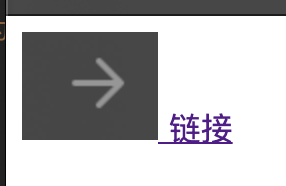


### a下载链接download属性

```html
<!-- 当你链接到要下载的资源而不是在浏览器中打开时，你可以使用 download 属性来提供一个默认的保存文件名。下面是一个 Firefox 的 Windows 最新版本下载链接的示例： -->

<a
  href="https://download.mozilla.org/?product=firefox-latest-ssl&os=win64&lang=zh-CN"
  download="firefox-latest-64bit-installer.exe"
  title="下载最新的 Firefox 中文版" >
  下载最新的 Firefox 中文版 - Windows（64 位）
</a>

<!--	download  标签提示要下载的内容 -->

<!---------------------------------------------------->
<!DOCTYPE html>
<html lang="zh-CN">
  <head>
    <meta charset="utf-8">
    <meta name="viewport" content="width=device-width">
    <title>My test page</title>
  </head>
  <body>
<a
  href="https://download.mozilla.org/?product=firefox-latest-ssl&os=win64&lang=zh-CN"
  download="firefox-latest-64bit-installer.exe"
  title="下载最新的 Firefox 中文版" >
  下载最新的 Firefox 中文版 - Windows（64 位）
</a>
  </body>
</html>
```

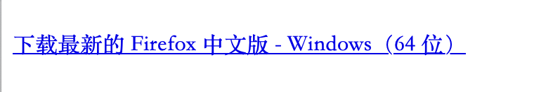


### a电子邮件链接mailto属性

```html
<!-- 指明收件人电子邮件地址的 mailto: 链接 -->
<!-- 下面的链接点击后，会默认拉起本地的邮箱应用，并自动填写收件人 -->
<a href="mailto:nowhere@mozilla.org">向 nowhere 发邮件</a>
	
	<!--  href 属性  指向链接 -->

也可以在邮件后面新增抄送人，密送和邮件内容。
<a
  href="mailto:nowhere@mozilla.org?cc=name2@rapidtables.com&bcc=name3@rapidtables.com&subject=The%20subject%20of%20the%20email&body=The%20body%20of%20the%20email">
  发送含有 cc、bcc、主题和主体的邮件
</a>

	<!-- href:   mailto:nowhere@mozilla.org  是收件人 -->
	<!-- href:   ?cc=name2@rapidtables.com   cc代表的是抄送, =号后面是邮件地址, 前面的? 问号是分隔符 -->
	<!-- href:   &bcc=name3@rapidtables.com   bcc代表是密 -->
	<!-- href:   &subject=The%20subject%20of%20the%20email&body=The%20body%20of%20the%20email  是邮件内容, %20 表示空格转义字符 -->


<!---------------------------------------------------->
<!DOCTYPE html>
<html lang="zh-CN">
  <head>
    <meta charset="utf-8">
    <meta name="viewport" content="width=device-width">
    <title>My test page</title>
  </head>
  <body>

<a
  href="mailto:nowhere@mozilla.org?cc=name2@rapidtables.com&bcc=name3@rapidtables.com&subject=The%20subject%20of%20the%20email&body=The%20body%20of%20the%20email">
  发送含有 cc、bcc、主题和主体的邮件
</a>

  </body>
</html>

```

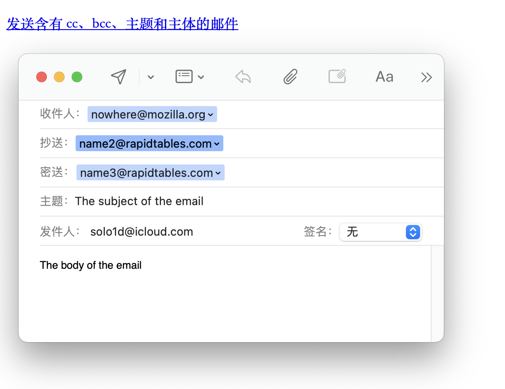


## img图片标签

```html
<!-- 显示图片,从左到右, 以底部为基准进行排列 ----------------------->
      <!-- px是单位 代表像素 -->
     <!-- 100% 代表撑满整个窗口,但不会出现移动条 -->


<!-------------------- 显示效果 ------------------------------------------->
<!DOCTYPE  html>
<html>
    <meta charset="UTF=8" />
    <head><title>图片</title> </head>
    <body>  </body>
</html>
```

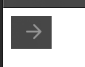

## table表格标签

```html
<!--    表格       -->
<table border="1px" cellspacing="0" width="600px" height="100px" >  
    <!-- 添加并设置边框为1像素 , 单元格间距设置为0 去掉重复框, 设置所有行列都是600宽度 ,100高度-->
    
<tbody></tbody>
    <!-- 表格中的内容, 应该写在这个标签内 -->
```

### col设置一列数据显示格式

```html
<col width="200xp" />   <!-- 设置每行的第一列的宽度为200像素点 -->

<!-------------------- 显示效果 ------------------------------------------->
<!DOCTYPE  html>
<html>
    <meta charset="UTF=8" />
    <head><title>表格col</title> </head>
    <body>
        <table   border="1px" cellspacing="0" >
            <tbody>
            <col width="100xp"/>  <!-- 设置每行的第一列 -->
            <col width="300xp" />  <!-- 设置每行的第二列 -->
            <tr> <td> 第一行</td><td>一行二列</td> </tr>
            <tr> <td> 第二行</td>  </tr>
            <tr> <td> 第三行</td> <td>三行二列</td> </tr>
            </tbody>
        </table>
    </body>
</html>
```

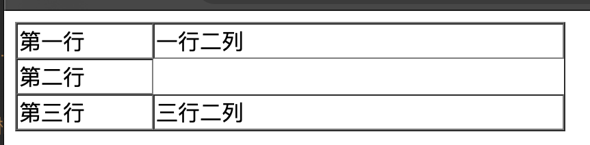


### colgroup设置一组数据显示格式

```html
<colgroup span="6" width="100xp" ></colgroup>
     <!-- 设置每行的前6列为100像素宽度 -->


<!-------------------- 显示效果 ------------------------------------------->
<!DOCTYPE  html>
<html>
    <meta charset="UTF=8" />
    <head><title>表格col</title> </head>
    <body>
        <table   border="1px" cellspacing="0" >
            <tbody>
            <colgroup width="200xp" span="3" ></colgroup>  <!-- 设置每行的前3列为200像素宽度 -->
            <tr> <td> 第一行</td><td>一行二列</td><td>一行三列</td><td>一行四列</td> </tr>
            <tr> <td> 第二行</td>  </tr>
            <tr> <td> 第三行</td> <td>三行二列</td> </tr>
		    <tr> <td> 第四行</td> <td>四行二列</td> </tr>	
            </tbody>
        </table>
    </body>
</html>
```

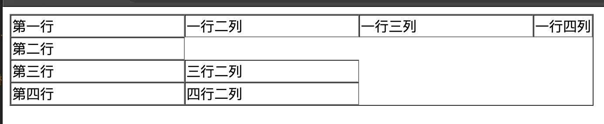

### tr表格中的行

```html
<tr height="40px" align="center" >  <td></td> </tr>
      <!-- 填写这一行所有的元素,设置该行内容居中, 占据高度40xp -->

<!-------------------- 显示效果 ------------------------------------------->
<!DOCTYPE  html>
<html>
    <meta charset="UTF=8" />
    <head><title>表格col</title> </head>
    <body>
        <table   border="1px" cellspacing="0" >
            <tbody>
            <tr  > <td > 第一行</td><td>一行二列</td><td>一行三列</td><td>一行四列</td> </tr>
            <tr height="40px" align="center"> <td width="130px"> 第二行</td>  </tr>
            <tr> <td> 第三行</td> <td>三行二列</td> </tr>
		    <tr> <td> 第四行</td> <td>四行二列</td> </tr>	
            </tbody>
        </table>
    </body>
</html>
```

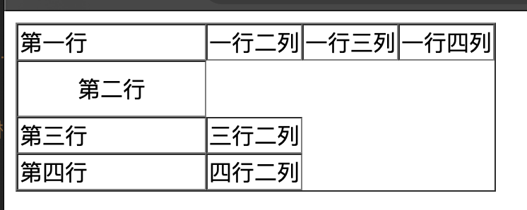

### td行中的列

```html
<td  width="200px" align="center" colspan="7" rowspan="3" >  </td>  
		<!-- 填写这一列的元素,设置空间和居中, 让这个单元 合并一行中的7列, 再合并一列中的 3行-->
        <!-- align属性有 : center居中, right右对齐, left左对齐
<!-------------------- 显示效果 ------------------------------------------->
<!DOCTYPE  html>
<html>
    <meta charset="UTF=8" />
    <head><title>表格col</title> </head>
    <body>
        <table   border="1px" cellspacing="0" >
            <tbody>
            <tr> <td> 第一行</td><td>一行二列</td><td>一行三列</td><td>一行四列</td> </tr>
            <tr> <td colspan="4" align="center"> 第二行</td>  </tr>
            <tr> <td> 第三行</td> <td>三行二列</td> <td rowspan="3" colspan="2">这里</td></tr>
		    <tr> <td> 第四行</td> <td>四行二列</td> </tr>	
            </tbody>
        </table>
    </body>
</html>
```

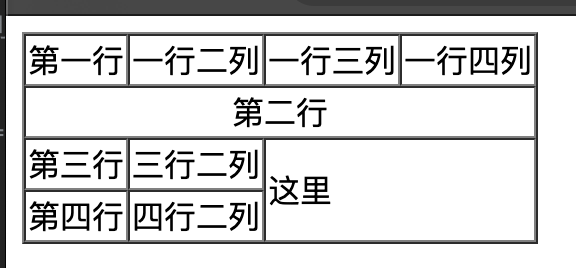

### th行中的列,简化

```html
<th> c </th>  <!-- th等同于 加粗并水平居中的 td -->
```


## input输入框或按钮,提交表单案例,有form标签

```html
<input type="text" , value="提交" name="user" />
    <!-- value 显示的内容, name 变量名,通过设置可以变成输入框和按钮 -->
    <!-- type 显示属性包括:  text文字文本, password密码框, button无效按钮, radio单选框, checkbox复选框,
                       submit提交按钮,  reset重置按钮, file文件选择框 ,select下拉框 , time时间-->
    <!-- input标签必须放在 form标签内一起使用,进行表单的提交 -->

<form action="网址" method="get" ></form>
   <!-- 必须要有 action标签, 属性是把表单提交给哪个地址 -->
   <!-- method属性为 get 是获取数据到本地的请求,  post是提交数据到服务器
   <!-- 所有需要提交的数据, input 必须有name属性


<!-------------------- 显示效果 ------------------------------------------->
<!DOCTYPE html>
<html>
	<head>
		<meta charset="utf-8">
		<title></title>
	</head>
	<body>
<!-- form action提交表单的地址, 必须要填写 -->
<!-- 点击提交后,网址会变成这样-> https://www.miaodongketang.cn/?loginName=asdad&pwd=asdasd  -->
		<form action="https://www.miaodongketang.cn">
			<table border="1px" cellspacing="0" width="600px" >
				<tbody>
					<tr  height="40px">
						<td rowspan="4" align="center" style="color: red;" >总体信息</td>  <!-- 合并一列中的四行-->
						<td colspan="2"></td>  <!-- 合并一行中的两列-->
					</tr>
					<tr height="40px"  >
						<td width="140px" align="right">用户名:</td>
						<td> <input type="text"  value="初始值" name="loginName"/> </td>
					</tr>
					<tr height="40px"> 
						<td width="140px" align="right">密码:</td>
						<td> <input type="password" name="pwd" /> </td>
					</tr>
					<tr height="40px">
						<td colspan="2" align="center"> 
							<input type="submit" value="提交" style="width: 80px; height: 30px; background-color: #E06C75 ;" />
							<input type="reset" value="重置" />
						</td>
					</tr>
				</tbody>
			</table>
		</form>
	</body>
</html>
```

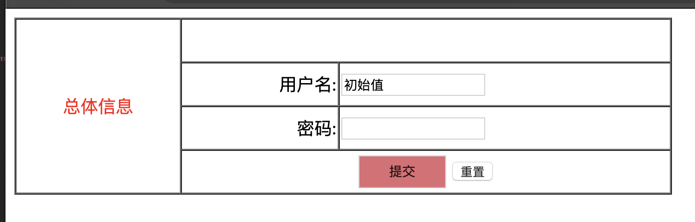


### get请求和post请求,提交数据和获取数据的表单补充内容

- **提交隐秘数据叫 `post` 请求,  提交普通数据叫 `get` 请求**
    - **两者的区别:**
        - get 请求通常表示获取数据
        - post 请求通常表示提交数据
        - get  请求发送的数据都写在地址栏上
        - post 请求发送的数据用户不可见.
        - **get请求不能提交大量数据, 但post可以, 因此不要混用**

```html
<!DOCTYPE html>
<html>
	<head>
		<meta charset="utf-8">
		<title></title>
	</head>
	<body>
        <!-- method="get" 点击提交后网址的数据 https://www.baidu.com/?login=asd&pass=pwd -->
        <!-- method="post" 点击提交后网址的数据  https://www.baidu.com/search/error.html -->
		<form action="http://www.baidu.com" method="get" >
			<p>
				<input type="text" name="login" value="asd" />
			</p>
			<p>
				<input type="password" name="pass" value="pwd" />
			</p>
			<p>
				<input type="submit" />
			</p>
		</form>
	</body>
</html>
```

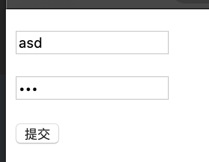


## span容器和div容器标签

- **span,  一个容器标签,不具备任何特殊功能, 仅当作容器来使用**
    - **用于包裹一段文本, 便于给文本增加样式**
        - **容器相当于是个隐形方框, 它包裹了写入的文本, 并且在这个方框内修改文本**
- **容器默认是看不见的**


- **div 一个通用容器标签, 不具备任何特殊功能, 仅当作容器来使用. 可以包裹任何内容,也可以包裹容器**
    - **甚至两个容器还可以发生重叠和覆盖**
- **容器特点:**
    - **空的div, 默认宽度 100%, 高度为0**
        - 当添加内容时, 容器的高度才会被撑开
- **属性 `height` 设置的是 div容器的高度**
    - **属性 `line-height` 设置的是 容器内的 行高, 如果将这两个值设置成相等, 那么文字会自动垂直居中**
- 

```html
<span style="text-align:center; margin:auto; background-color:gray; font-size:24px; color:white; "> 文本 </span>

<!-- text-align:center; 让内部元素(文本)水平居中,  margin:auto; 让元素(容器)本身水平居中 -->
<!-- color:white;  设置文字颜色background-color: gray; 设置背景颜色  -->
<!-- font-size:24xp; 设置字体大小 -->


<!-------------------- 显示效果 ------------------------------------------->
<!DOCTYPE html>
<html>
	<head>
		<meta charset="utf-8">
		<title></title>
	</head>
	<body>
		<!-- 使用div来包裹容器,设置容器距离两边的宽度为自动 会自动居中margin: auto,
		      左右两边的宽度 width: 500px, 以及容器的最小宽度-->
		<!-- 当设置容器的最小宽度  width之后, 网页缩小就不能小于这个宽度了-->
		<div style="color: #5c5e62; margin: auto; width: 500px;"> 
		
		<!-- 将深海简介 居中 -->
		<p align="center">
			<!-- 然后 针对 文本进行设置.并不作用于位置关系 , 背景颜色是灰色gray, 字体白色, 字号24像素 -->
			<span style=" background-color: gray; color: white; font-size: 24px;">
				 深海简介
			</span>
		</p>
		
		<p>
			 <strong>那么我看的时候应该是十岁出头，看到一半</strong>
		    <span style="color: darkgreen;">(那个人脑袋里长出的东西布满了整个墙）之后直接扯着我妈尖叫想带着饮料回家我妈：</span>
			？不是很恐怖啊
		 </p>
		 
		<p>
			<strong>然后结尾女主见到了那个骷髅和那个镜像一样的东西时 我直接升天了（小时候对骷髅骨头尸体这种怕到死）</strong>
		</p>
		<p>
			<span style="color: #f6a829;">买张电影票 你买不了吃亏 买不了上当我妈我妈：？不是很恐怖啊我妈：？不是很恐怖啊：</span>
			<strong>买张电影票 你买不了吃亏 买不了上当我妈我妈：</strong>
			？不是很恐怖啊我妈：？不是很恐怖啊：
			买张电影票 你买不了吃亏 买不了上当我妈我妈：
			<strong>？不是很恐怖啊我妈：？不是很恐怖啊：</strong>
		</p>
		</div>
	</body>
</html>
```

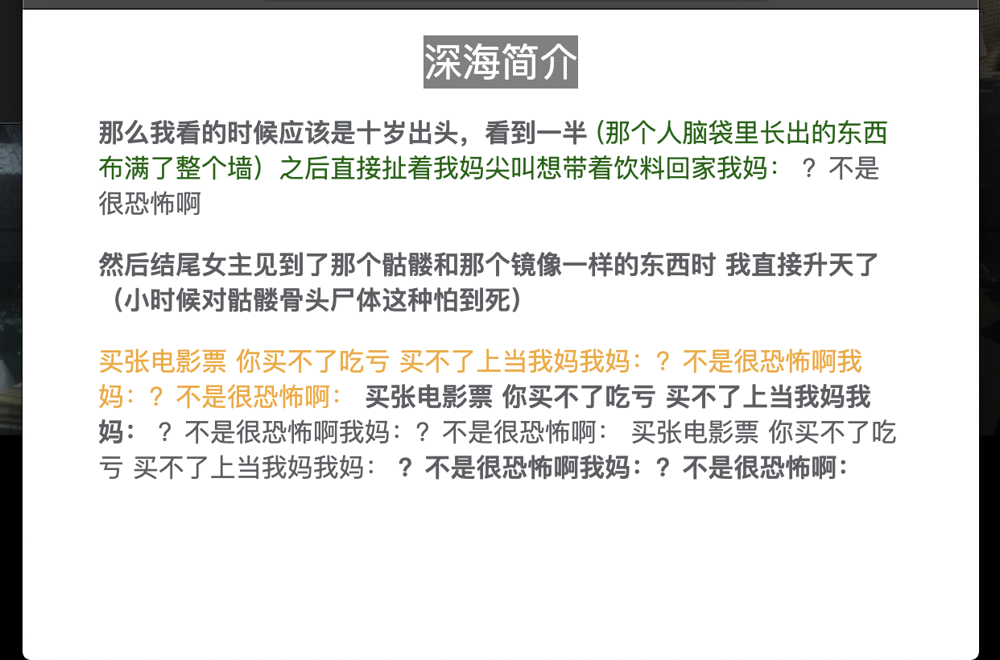


## video视频元素标签

```html
<!-- <vide> 允许你轻松地嵌入一段视频 -->

<video
  controls
  width="400"
  height="400"
  autoplay
  loop
  muted
  preload="auto"
  poster="poster.png">
  <source src="rabbit320.mp4" type="video/mp4" />
  <source src="rabbit320.webm" type="video/webm" />
  <p>
    你的浏览器不支持 HTML5 视频。可点击<a href="rabbit320.mp4">此链接</a>观看
  </p>
</video>

	<!-- src   是视频的源路径 -->
  <!-- controls 属性 用户必须能够控制视频和音频的回放功能。你可以使用 controls 来包含浏览器提供的控件界面，同时你也可以使用合适的 JavaScript API 创建自己的界面。界面中至少要包含开始、停止以及调整音量的功能。 -->
  <!-- <video> 标签内的内容
这个叫做后备内容 — 当浏览器不支持 <video> 标签的时候，就会显示这段内容，这使得我们能够对旧的浏览器提供回退内容。你可以添加任何后备内容，在这个例子中我们提供了一个指向这个视频文件的链接，从而使用户至少可以访问到这个文件，而不会局限于浏览器的支持。 -->
    autoplay    自动播放属性
    loop        音频或者视频文件循环播放
    muted       默认关闭声音
    poster      图像的 URL，这个图像会在视频播放前显示
    preload     来缓冲较大的文件，有 3 个值可选：
                    "none" ：不缓冲
                    "auto" ：页面加载后缓存媒体文件
                    "metadata" ：仅缓冲文件的元数据

```


## audio音频元素标签
```html
<!-- 音频标签基本上和video 相同 -->
<audio controls>
  <source src="viper.mp3" type="audio/mp3" />
  <source src="viper.ogg" type="audio/ogg" />
  <p>你的浏览器不支持 HTML5 音频，可点击<a href="viper.mp3">此链接</a>收听。</p>
</audio>

```


## iframe嵌入式标签
```html
<iframe 
    src="//player.bilibili.com/player.html?aid=408948627&bvid=BV1jG411i7vb&cid=1345897342&p=1"
    width="100%"
    height="500"
    frameborder="no"
    scrolling="no" 
    border="0"  
    framespacing="0" 
    allowfullscreen="true"
    sandbox> 
</iframe>
    src             指向要嵌入文档的 URL 路径。
    frameborder     如果设置为 1，则会告诉浏览器在此框架和其他框架之间绘制边框，这是默认行为。0 删除边框。
    scrolling       
    border
    framespacing
    allowfullscreen 可以通过全屏API 设置为全屏模式
    sandbox         该属性可以提高安全性设置


```

## emdeb和object通用嵌入工具标签
**插件是一种对浏览器原生无法读取的内容提供访问权限的软件。**
```html
这些元素是用来嵌入多种类型的外部内容的通用嵌入工具，其中包括像 Java 小程序和 Flash，PDF（可在浏览器中显示为一个 PDF 插件）这样的插件技术，甚至像视频，SVG 和图像的内容！

<embed
  src="whoosh.swf"
  quality="medium"
  bgcolor="#ffffff"
  width="550"
  height="400"
  name="whoosh"
  align="middle"
  allowScriptAccess="sameDomain"
  allowFullScreen="false"
  type="application/x-shockwave-flash"
  pluginspage="http://www.macromedia.com/go/getflashplayer" />

  <!-- embed元素嵌入 Flash 影片的范例 -->


  <object
  data="mypdf.pdf"
  type="application/pdf"
  width="800"
  height="1200"
  typemustmatch>
  <p>
    You don't have a PDF plugin, but you can
    <a href="myfile.pdf">download the PDF file.</a>
  </p>
</object>

 <!-- object 将 PDF 嵌入一个页面的例子 -->
```

## svg矢量图标记
```html
以下代码创建一个圆和一个矩形：

<svg
  version="1.1"
  baseProfile="full"
  width="300"
  height="200"
  xmlns="http://www.w3.org/2000/svg">
  <rect width="100%" height="100%" fill="black" />
  <circle cx="150" cy="100" r="90" fill="blue" />
</svg>
    
    绘画出来一个 黑色方块底，蓝色的圆圈。

<!-- 使用 <iframe> 嵌入 SVG -->
<iframe src="triangle.svg" width="500" height="500" sandbox>
  
</iframe>


```
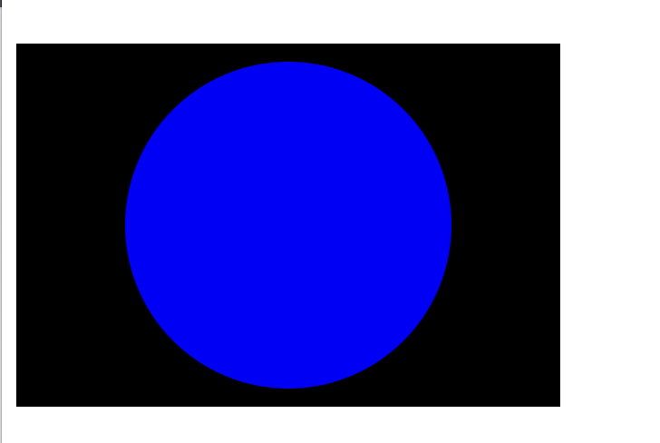


## HTML布局元素细节

- `<main>`  存放每个页面独有的内容。每个页面上只能用一次 `<main>`，且直接位于 `<body>` 中。最好不要把它嵌套进其他元素。
- `<article>` 包围的内容即一篇文章，与页面其他部分无关（比如一篇博文）。
- `<section>` 与 `<article>` 类似，但 `<section>` 更适用于组织页面使其按功能（比如迷你地图、一组文章标题和摘要）分块。一般的最佳用法是：以  **标题** 作为开头；也可以把一篇 `<article>` 分成若干部分并分别置于不同的 `<section>` 中，也可以把一个区段 `<section>` 分成若干部分并分别置于不同的 `<article>` 中，取决于上下文。
- `<aside>` 包含一些间接信息（术语条目、作者简介、相关链接，等等）。
- `<header>` 是简介形式的内容。如果它是 `<body>` 的子元素，那么就是网站的全局页眉。如果它是`<article>` 或 `<section>`的子元素，那么它是这些部分特有的页眉（此 `<header>` 非彼 **标题**）。
- `<nav>`包含页面主导航功能。其中不应包含二级链接等内容。
- `<footer>` 包含了页面的页脚部分。