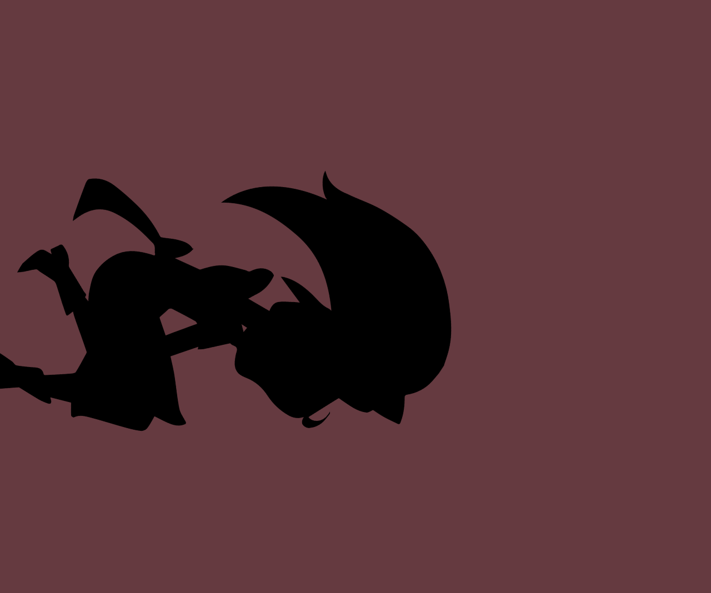

## 目录

- [javaScript高层定义](#javaScript高层定义)
- [js监听器](#js监听器)
  - [async和defer属性](#async和defer属性)
  - [事件监听器](#事件监听器)
    - [添加监听器](#添加监听器)
    - [移除监听器](#移除监听器)
  - [事件](#事件)
  - [事件对象](#事件对象)
    - [事件对象的额外属性](#事件对象的额外属性)
    - [阻止默认行为](#阻止默认行为)
  - [事件冒泡](#事件冒泡)
    - [使用stopPropagation方法修复问题](#使用stopPropagation方法修复问题)
  - [事件捕获](#事件捕获)
  - [事件委托](#事件委托)
- [循环](#循环)
- [一个猜随机数的例子](#一个猜随机数的例子)
- [onclick属性](#onclick属性)
- [对象Object](#对象Object)
- [变量或表达式串联](#变量或表达式串联)
- [在字符串中包含表达式](#在字符串中包含表达式)
- [字符串和数字转换](#字符串和数字转换)
- [字符串操作方法](#字符串操作方法)
- [数组](#数组)
- [函数参数](#函数参数)
- [JavaScript对象](#JavaScript对象)
  - [对象成员访问方式](#对象成员访问方式)
  - [this的含义](#this的含义)
  - [对象构造函数](#对象构造函数)
  - [使用构造函数](#使用构造函数)
- [对象原型](#对象原型)
  - [设置原型](#设置原型)
- [类和构造函数](#类和构造函数)
  - [继承](#继承)
  - [封装](#封装)
- [JSON结构](#JSON结构)
- [弹跳小球范例](#弹跳小球范例)
- [javaScript异步](#javaScript异步)
  - [使用异步API访问HTTP服务器](#使用异步API访问HTTP服务器)
  - [回调](#回调)
  - [Promise](#Promise)
  - [链式使用Promise](#链式使用Promise)
  - [错误捕获](#错误捕获)
  - [Promise术语](#Promise术语)
  - [合并使用多个Promise](#合并使用多个Promise)
  - [async和await](#async和await)
  - [如何实现基于Promise的API](#如何实现基于Promise的API)
    - [实现alarm()API](#实现alarm()API)
  - [Promise构造器](#Promise构造器)
 - [workers](#workers)
 - [序列动画](#序列动画)

# javaScript高层定义
```html
    <p>Player 1: Chris</p>
    <!-- 这个脚本一定要在 p 标签之后加载 -->
    <script src="./script.js"></script>
```
```css
p {
  font-family: "helvetica neue", helvetica, sans-serif;  /* 设置了字体系列，按照给定的顺序，首选字体为 “helvetica neue”，如果该字体不可用，则选择 helvetica，最后备用的字体为 sans-serif。 */
  letter-spacing: 1px;  /* 设置字母间距为 1 像素。 */
  text-transform: uppercase;    /* 转换文本为大写字母。 */
  text-align: center;           /* 设置文本居中对齐。 */
  border: 2px solid rgb(0 0 200 / 0.6);   /* 设置一个 2 像素宽的实线边框，颜色为透明度为 0.6 的蓝色（RGB 值为 0、0、200）*/
  background: rgb(0 0 200 / 0.6);     /* 设置背景颜色为透明度为 0.6 的蓝色。 */
  color: rgb(255 255 255 / 1);        /*  设置文本颜色为完全不透明的白色。 */
  box-shadow: 1px 1px 2px rgb(0 0 200 / 0.4);   /* 添加一个 1 像素偏移的 2 像素模糊的阴影效果，颜色为透明度为 0.4 的蓝色。 */
  border-radius: 10px;      /* 设置边框的圆角半径为 10 像素。 */
  padding: 3px 10px;        /* 设置内边距为上下各 3 像素，左右各 10 像素。  */
  display: inline-block;    /* 将元素设置为内联块元素，使其在一行中显示，并具有块级元素的盒模型特性。 */
  cursor: pointer;          /* 将光标样式设置为指针样式，表示该元素可点击。 */
}

```

```javascript
const para = document.querySelector("p");  // 通过 querySelectorAll() 函数，可以选择页面上的所有按钮
console.info(para); // 输入log
// 使用 addEventListener() 为每个按钮分配一个处理器
para.addEventListener("click", updateName);  // 用一个 click 事件来检测按钮什么时候被点击，然后运行代码更新文本标签。

function updateName(el) {
  const name = prompt("Enter a new name");
  para.textContent = `Player 1: ${name}`;
}
```


# js监听器
```javascript
// 这是一个事件监听器，它监听浏览器的 DOMContentLoaded 事件，其标志了 HTML 文档体完全加载和解析。
// 该代码块中的 JavaScript 在事件被触发后才会运行，因此避免了错误
document.addEventListener("DOMContentLoaded", () => {
  // …
});
```

## async和defer属性
脚本阻塞问题实际有两种解决方案——async 和 defer
- async
  - 浏览器遇到 async 脚本时不会阻塞页面渲染，而是直接下载然后运行。但是，一旦下载完成，脚本就会执行，从而阻止页面渲染。脚本的运行次序无法控制
- defer
  - 使用 defer 属性加载的脚本将按照它们在页面上出现的顺序加载。在页面内容全部加载完毕之前，脚本不会运行，如果脚本依赖于 DOM 的存在（例如，脚本修改了页面上的一个或多个元素），这一点非常有用。
```html
// async 属性
<script async src="js/vendor/jquery.js"></script>

// defer 属性
<script defer src="js/script2.js"></script>
```

## 事件监听器
侦听事件发生的结构称为事件监听器（Event Listener），响应事件触发而运行的代码块被称为事件处理器（Event Handler）。

### 添加监听器
```html
<input type="submit" value="Submit guess" class="guessSubmit" />
```
```javascript
// 下面的代码表示，当点击在页面上的一个  Submit guess 按钮后，就会触发 checkGuess 函数，并弹出一个窗口。

// 找到文档中具有 guessSubmit 类名的元素，并将其存储在变量 guessSubmit 中。
const guessSubmit = document.querySelector(".guessSubmit"); 
// 为找到的元素添加了一个点击事件监听器，当用户点击该元素时(就是发生click事件)，会调用 checkGuess 函数。
guessSubmit.addEventListener("click", checkGuess);
// 在添加一个点击处理事件监听器
// 当点击按钮时，所有处理器函数都会运行
guessSubmit.addEventListener("click", checkGuess);
function checkGuess() {
  // 弹出一个告警窗口，显示 I am a placeholder
  alert("I am a placeholder");
}
```
### 移除监听器
`changeBackground()` 方法移除监听器。
```js
const btn = document.querySelector("button");
function random(number) {
  return Math.floor(Math.random() * (number + 1));
}


// 移除方式1
btn.removeEventListener("click", changeBackground);

// 移除方式2
// 事件处理器也可以通过传递 AbortSignal 到 addEventListener()，然后在拥有 AbortSignal 的控制器上调用abort()，
//   从而删除事件处理器。例如，要添加一个可以使用 AbortSignal 来删除的事件处理器，可以这样做：
const controller = new AbortController();

btn.addEventListener("click",
  () => {
    const rndCol = `rgb(${random(255)}, ${random(255)}, ${random(255)})`;
    document.body.style.backgroundColor = rndCol;
  },
  { signal: controller.signal } // 向该处理器传递 AbortSignal
);

// 移除方式3
//  删除上面代码创建的事件处理器
controller.abort(); // 移除任何/所有与该控制器相关的事件处理器

```


## 事件
为了对一个事件做出反应，你要给它附加一个事件处理器。
web 事件不是 JavaScript 语言的核心——它们被定义成内置于浏览器的 API。
```html
<button>改变颜色</button>
```
```js
const btn = document.querySelector("button");

function random(number) {
  return Math.floor(Math.random() * (number + 1));
}

// 注册点击事件
btn.addEventListener("click", () => {
  const rndCol = `rgb(${random(255)}, ${random(255)}, ${random(255)})`;
  document.body.style.backgroundColor = rndCol;
});
```
- `addEventListener("事件", 处理函数)` 添加事件处理器的机制函数， 主要可以监听的事件有：
  - focus 和 blur：当按钮被聚焦或失焦时，颜色会改变；尝试按下 tab 键来聚焦于按钮，再次按下该键来使按钮失去焦点。这些事件通常用于在聚焦时显示填入表单字段的信息，或者在表单字段填入不正确的值时显示错误信息。
  - dblclick：颜色只在按钮被双击时改变。
  - mouseover 和 mouseout：当鼠标指针在按钮上悬停，或指针移出按钮时，颜色分别会改变。
  - click 点击事件

## 事件对象
有时候在事件处理函数内部，你可能会看到一个固定指定名称的参数，例如 event、evt 或 e。这被称为事件对象，它被自动传递给事件处理函数，以提供额外的功能和信息
```js
const btn = document.querySelector("button");

function random(number) {
  return Math.floor(Math.random() * (number + 1));
}

function bgChange(e) {
  const rndCol = `rgb(${random(255)}, ${random(255)}, ${random(255)})`;
  e.target.style.backgroundColor = rndCol;
  console.log(e); // 这里会打印 e 对象的详细信息
}

btn.addEventListener("click", bgChange);
```


### 事件对象的额外属性
大多数事件对象都有一套标准的属性和方法
一些事件对象添加了与该特定类型的事件相关的额外属性。例如，keydown 事件在用户按下一个键时发生。它的事件对象是 KeyboardEvent，它是一个专门的 Event 对象，有一个 key 属性，告诉你哪个键被按下：
```js
const textBox = document.querySelector("#textBox");
const output = document.querySelector("#output");
textBox.addEventListener("keydown", (event) => {
  output.textContent = `You pressed "${event.key}".`; // 会输出按键的数值
});
```
```html
<input id="textBox" type="text" />
<div id="output"></div>
```
### 阻止默认行为
有时，你会遇到一些情况，你希望事件不执行它的默认行为
```js
const form = document.querySelector("form");
const fname = document.getElementById("fname");
const lname = document.getElementById("lname");
const para = document.querySelector("p");

// submit 监听表单的提交事件
form.addEventListener("submit", (e) => {
  if (fname.value === "" || lname.value === "") {
    e.preventDefault();
    para.textContent = "You need to fill in both names!";
  }
});
```
```html
<form>
  <div>
    <label for="fname">First name: </label> <!-- for属性表示点击会将光标跳转到 fname 这个id标签内 -->
    <input id="fname" type="text" />
  </div>
  <div>
    <label for="lname">Last name: </label>
    <input id="lname" type="text" />
  </div>
  <div>
    <input id="submit" type="submit" />
  </div>
</form>
<p></p>
```

## 事件冒泡
事件冒泡描述了浏览器如何处理针对嵌套元素的事件。
在父元素上设置监听器.
```html
    <div id="container">
      <button>点我！</button>
    </div>
    <pre id="output"></pre>
```
```js
const output = document.querySelector("#output");
function handleClick(e) {
  output.textContent += `你在 ${e.currentTarget.tagName} 元素上进行了点击\n`;
}

const container = document.querySelector("#container");
const button = document.querySelector("button");

document.body.addEventListener("click", handleClick);
container.addEventListener("click", handleClick);
button.addEventListener("click", handleClick);
```
你会发现在用户单击按钮时，所有三个元素都触发了单击事件：


在这种情况下：
- 最先触发按钮上的单击事件
- 然后是按钮的父元素（<div> 元素）
- 然后是 <div> 的父元素（<body> 元素）

**事件从被点击的最里面的元素冒泡而出。**

### 使用stopPropagation方法修复问题
事件冒泡有时会产生问题，但有一种方法可以防止这些问题。Event 对象有一个可用的函数，叫做 stopPropagation()，当在一个事件处理器中调用时，可以防止事件向任何其他元素传递。
```js
const btn = document.querySelector("button");
const box = document.querySelector("div");
const video = document.querySelector("video");

btn.addEventListener("click", () => box.classList.remove("hidden"));

video.addEventListener("click", (event) => {
  event.stopPropagation();    // 这里
  video.play();
});

box.addEventListener("click", () => box.classList.add("hidden"));
```

## 事件捕获
事件传播的另一种形式是事件捕获。这就像事件冒泡，但顺序是相反的：事件不是先在最内层的目标元素上发生，然后在连续较少的嵌套元素上发生，而是先在最小嵌套元素上发生，然后在连续更多的嵌套元素上发生，直到达到目标。
事件捕获默认是禁用的，你需要在 `addEventListener()` 的 `capture` 选项中启用它。
```html
<body>
  <div id="container">
    <button>点我！</button>
  </div>
  <pre id="output"></pre>
</body>
```
```js
const output = document.querySelector("#output");
function handleClick(e) {
  output.textContent += `你在 ${e.currentTarget.tagName} 元素上进行了点击\n`;
}

const container = document.querySelector("#container");
const button = document.querySelector("button");

document.body.addEventListener("click", handleClick, { capture: true });
container.addEventListener("click", handleClick, { capture: true });
button.addEventListener("click", handleClick);
```
在这种情况下，消息出现的顺序发生了颠倒：`<body>` 事件处理器首先触发，然后是 `<div>` 的，最后是 `<button>` 的：

默认情况下，几乎所有的事件处理程序都是在冒泡阶段注册的，这在大多数情况下更有意义。

## 事件委托
事件冒泡并不只是令人讨厌：它可以非常有用。特别是，它可以实现事件委托。在这种做法中，当我们想在用户与大量的子元素中的任何一个互动时运行一些代码时，我们在它们的父元素上设置事件监听器，让发生在它们身上的事件冒泡到它们的父元素上，而不必在每个子元素上单独设置事件监听器。
当用户点击一个按钮时，我们设置整个页面的背景颜色。假设取而代之的是，页面被分为 16 个区域，我们想在用户点击每个区域时将其设置为随机颜色。

```html
<div id="container">
  <div class="tile"></div>
  <div class="tile"></div>
  <div class="tile"></div>
  <div class="tile"></div>
  <div class="tile"></div>
  <div class="tile"></div>
  <div class="tile"></div>
  <div class="tile"></div>
  <div class="tile"></div>
  <div class="tile"></div>
  <div class="tile"></div>
  <div class="tile"></div>
  <div class="tile"></div>
  <div class="tile"></div>
  <div class="tile"></div>
  <div class="tile"></div>
</div>
```
```css
.tile {
  height: 100px;
  width: 25%;
  float: left;
}
```
```js
function random(number) {
  return Math.floor(Math.random() * number);
}

function bgChange() {
  const rndCol = `rgb(${random(255)}, ${random(255)}, ${random(255)})`;
  return rndCol;
}
// 父元素监听了点击事件
const container = document.querySelector("#container");

container.addEventListener("click", (event) => {
  event.target.style.backgroundColor = bgChange();
});
```


## 循环
```javascript
// 这段代码通过 querySelectorAll() 方法创建了一个包含 <div class="resultParas"> 内所有段落<p>的变量，
// 然后通过循环迭代，删除每个段落的文本内容。
// 即使 resetParas 是一个常量，我们也可以更改其内部属性，例如 textContent。
const resetParas = document.querySelectorAll(".resultParas p");
for (const resetPara of resetParas) {
  resetPara.textContent = "";
}
```
## 一个猜随机数的例子
```html
<!doctype html>
<html lang="zh-CN">
  <head>
    <meta charset="utf-8" />
    <meta name="viewport" content="width=device-width" />
    <title>我的 CSS 实验</title>
    <!-- <link rel="stylesheet" href="styles.css" /> -->
    
  </head>
  <body>
  
    <div class="resultParas">
      <p class="guesses"></p>
      <p class="lastResult"></p>
      <p class="lowOrHi"></p>
    </div>

    <!-- 接下来的两个常量存储对表单文本输入和提交按钮的引用，并用于控制以后提交猜测：  -->
    <label for="guessField">Enter a guess: </label>
    <input type="number" id="guessField" class="guessField" />
    <input type="submit" value="Submit guess" class="guessSubmit" />
  <!-- 这个脚本一定要在 p 标签之后加载 -->
  <script src="./script.js"></script>
  </body>
</html>
```
```javascript
// let 和一个名字来创建变量
let randomNumber = Math.floor(Math.random() * 100) + 1;

// const 和一个名字来创建常量
const guesses = document.querySelector(".guesses");
const lastResult = document.querySelector(".lastResult");
const lowOrHi = document.querySelector(".lowOrHi");

const guessSubmit = document.querySelector(".guessSubmit");
const guessField = document.querySelector(".guessField");

// 这一行通过 focus() (en-US) 方法让光标在页面加载完毕时自动放置于 <input> 输入框内，这意味着玩家可以马上开始第一次猜测，而无需点击输入框。
guessField.focus();

// 计数器并初始化为 1（用于跟踪玩家猜测的次数
let guessCount = 1;
// 存储对重置按钮的引用
let resetButton;

function checkGuess() {
  // 弹出一个告警窗口，显示 I am a placeholder
  // alert("I am a placeholder");
  const userGuess = Number(guessField.value);
  if (guessCount === 1) {
    guesses.textContent = "Previous guesses: ";
  }
  guesses.textContent += `${userGuess} `;

  if (userGuess === randomNumber) {
    lastResult.textContent = "Congratulations! You got it right!";
    lastResult.style.backgroundColor = "green";
    lowOrHi.textContent = "";
    setGameOver();
  } else if (guessCount === 10) {
    lastResult.textContent = "!!!GAME OVER!!!";
    lowOrHi.textContent = "";
    setGameOver();
  } else {
    lastResult.textContent = "Wrong!";
    lastResult.style.backgroundColor = "red";
    if (userGuess < randomNumber) {
      lowOrHi.textContent = "Last guess was too low!";
    } else if (userGuess > randomNumber) {
      lowOrHi.textContent = "Last guess was too high!";
    }
  }

  guessCount++;
  guessField.value = "";
  guessField.focus();
}

function setGameOver() {
  guessField.disabled = true;
  guessSubmit.disabled = true;
  resetButton = document.createElement("button");
  resetButton.textContent = "Start new game";
  document.body.append(resetButton);
  resetButton.addEventListener("click", resetGame);
}

function resetGame() {
  guessCount = 1;
  // 清除所有信息段落。这里，我们选择 <div class="resultParas"></div> 内的所有段落，然后通过循环迭代，
  // 将它们的 textContent 设置为 ''（一个空字符串）。
  const resetParas = document.querySelectorAll(".resultParas p");
  for (const resetPara of resetParas) {
    resetPara.textContent = "";
  }

  resetButton.parentNode.removeChild(resetButton);

  guessField.disabled = false;
  guessSubmit.disabled = false;
  guessField.value = "";
  guessField.focus();

  lastResult.style.backgroundColor = "white";

  randomNumber = Math.floor(Math.random() * 100) + 1;
}

checkGuess();
guessSubmit.addEventListener("click", checkGuess);
```


## onclick属性
```html
<button>Press me</button>
```
这段 JavaScript 代码将一个匿名函数赋值给 button.onclick 属性。当点击这个按钮时，该匿名函数将被执行。
该匿名函数的功能如下：
- 弹出一个提示框，要求用户输入名字。
- 使用用户输入的名字，构造一条欢迎消息。
- 弹出一个对话框，显示欢迎消息。
这样，当用户点击按钮时，就会出现一个提示框，要求输入名字，然后弹出一个对话框，显示欢迎消息，消息中包含用户输入的名字。这段代码实现了一个简单的问候功能。
```javascript
const button = document.querySelector("button");

button.onclick = function () {
  let name = prompt("What is your name?");
  alert("Hello " + name + ", nice to see you!");
};
```


## 对象Object
```javascript
// 建立对象
let dog = { name: "Spot", breed: "Dalmatian" };
// 获得对象中的成员信息
dog.name;
```

## 变量或表达式串联
```javascript
const one = "你好，";
const two = "请问最近如何？";
const joined = `${one}${two}  请回复`;
console.log(joined); // "你好，请问最近如何？ 请回复"
```
实际应用的例子
```html
<button>按这里</button>
<div id="greeting"></div>
```
```javascript
const button = document.querySelector("button");

function greet() {
  // prompt() 函数，它要求用户在弹出的对话框中回答一个问题然后将他们输入的文本存储在一个给定的变量中
  const name = prompt("你叫什么名字？");
  const greeting = document.querySelector("#greeting");
  greeting.textContent = `你好呀，${name}！很高兴见到你！`;   // 模板
}

button.addEventListener("click", greet);
```

## 在字符串中包含表达式
```js
const song = "青花瓷";
const score = 9;
const highestScore = 10;
const output = `我喜欢歌曲《${song}》。我给它打了 ${
  (score / highestScore) * 100
} 分。`;
console.log(output); // "我喜欢歌曲《青花瓷》。我给它打了 90 分。"
```

## 字符串和数字转换
```js
// 转换数字
const myString = "123";
const myNum = Number(myString);
console.log(typeof myNum);
// number

// 转换字符串
const myNum2 = 123;
const myString2 = String(myNum2);
console.log(typeof myString2);
// string
```

## 字符串操作方法
**获得字符串的长度**
```js
let browserType = "mozilla";
browserType.length;
// 结果应该返回一个数字：7
```
**检索特定字符串字符**
```js
// 访问第一个字符
browserType[0];
// 访问最后一个字符
browserType[browserType.length - 1];
```
**在字符串中查找子字符串并提取它**
```js
// 在字符串对象 browserType 中 寻找子字符串 zilla
browserType.indexOf("zilla");

// 当在主字符串中找不到子字符串（在本例中为“zilla”）时将返回 -1。 
if (browserType.indexOf("mozilla") !== -1) {
  // 找不到时 会进入这里
}


// 截取字符串， 从browserType 中 获取 0到3 下标的字符 ，并组成字符串返回
browserType.slice(0, 3);
// 截取从下标2 之后的所有字符串（包括2）
browserType.slice(2);
```
**转换大小写**
```js
// 字符串方法toLowerCase()和toUpperCase()字符串并将所有字符分别转换为小写或大写
let radData = "My NaMe Is MuD";
radData.toLowerCase();  // 输出： my name is mud
radData.toUpperCase();  // 输出： MY NAME IS MUD
```
**替换字符串的某部分**
```js
// 使用replace()方法将字符串中的一个子字符串替换为另一个子字符串 ，并输入，但是不会修改原本的对象内容。
// 下面进行赋值 才可以进行修改。
browserType = browserType.replace('moz','van');
```

## 数组
**将任何类型的元素存储在数组中,可以混合和匹配项目类型.**
**创建数组**
```js
// 一种只有字符串的数组
let shopping = ["bread", "milk", "cheese", "hummus", "noodles"];
shopping;

// 包含任何信息的数组。、
let sequence = [1, 1, 2, 3, 5, 8, 13];
let random = ["tree", 795, [0, 1, 2]];
```
**访问和修改数组元素**
```js
// 访问一维数组
shopping[0];
// returns "bread"

// 访问二维数组
random[2][2];

// 修改数组值
shopping[0] = "tahini";
shopping;
// shopping will now return [ "tahini", "milk", "cheese", "hummus", "noodles" ]
```

**获取数组长度**
```js
sequence.length;
// should return 7

// 遍历数组
let sequence = [1, 1, 2, 3, 5, 8, 13];
for (let i = 0; i < sequence.length; i++) {
  console.log(sequence[i]);
}
```

**字符串和数组之间的转换**
```js
let myData = "Manchester,London,Liverpool,Birmingham,Leeds,Carlisle";
let myArray = myData.split(",");  // 将字符串进行切分，按照 , 逗号字符进行拆分

//找到新数组的长度，并从中检索一些项目：
myArray.length;
myArray[0]; // the first item in the array
myArray[1]; // the second item in the array
myArray[myArray.length - 1]; // the last item in the array

// 将数组中的元素进行组合, 使用 加号 进行链接
let myNewString = myArray.join("+");
myNewString;  //  Manchester+London+Liverpool+Birmingham+Leeds+Carlisle

// 将数组转换为字符串的另一种方法是使用 toString() 方法。 默认是逗号进行组合
let dogNames = ["Rocket", "Flash", "Bella", "Slugger"];
dogNames.toString(); //Rocket,Flash,Bella,Slugger
```
**添加和删除数组项**
```js
let myArray = [
  "Manchester",
  "London",
  "Liverpool",
  "Birmingham",
  "Leeds",
  "Carlisle",
];
// 压入 一个数据到末尾， 返回压入后的新数组元素个数
myArray.push("Cardiff");
// 压入 两个数据到末尾， 返回压入后的新数组元素个数
myArray.push("Bradford", "Brighton");

// 获得压入后的新数组元素个数
let newLength = myArray.push("Cardiff");

// 删除最后一个元素，并返回已删除的项目
let removedItem = myArray.pop();

// 将  Edinburgh 元素，压入到数组的开头第一个位置
myArray.unshift("Edinburgh");

// 将数组的第一个元素弹出，并返回已删除的项目
let removedItem1 = myArray.shift();

// 弹出指定的项
alert(myArray[1]);
```
## 函数参数
```js
let name1 ="asdasldnlasj"
// 可传入两个参数
function print(varlu1, value2){
  console.log( `${varlu1}  ${value2} name1` );
  return `${varlu1}  ${value2}`;
}
print(name1, "123131");
```


# JavaScript对象
**创建一个空对象**
```js
const person = {};
```
**创建一个普通对象,有方法和成员**
```js
// 每一组 名字或者值 必须由逗号分隔开，并且名字和值之间由冒号分隔
const person = {
  name: ["Bob", "Smith"],
  age: 32,
  bio: function () {
    console.log(`${this.name[0]} ${this.name[1]} 现在 ${this.age} 岁了。`);
  },
  introduceSelf: function () {
    console.log(`你好！我是 ${this.name[0]}。`);
  },
  posFunction() { // 这个是简写版的 成员函数
    console.log(`pos ${this.name[0]}。`);
  },
};

// 下面的获得值
person.name;
person.name[0];
person.age;
person.bio();
// "Bob Smith 现在 32 岁了。"
person.introduceSelf();
// "你好！我是 Bob。"
```

### 对象成员访问方式
```js
// 第一种表述
const person1 = {
  name: ["Bob", "Smith"],
};
  // 访问方式
person1.name[0];
person1.name[1];

// 第二种表述
const person2 = {
  name: {
    first: "Bob",
    last: "Smith",
  },
};
// 访问方式
person2.name.first;
person2.name.last;

// 第三种表述，括号表示法
const person3 = {
  name: ["Bob", "Smith"],
  age: 32,
  othen: {
    address: "jl",
    phone: "123123",
  },
};
// 访问方式  , 一般在不知道成员名称的情况下 进行遍历使用
person3["age"];
person3["name"][0];
person3["othen"]["phone"];

// 第四种表述，新增一个成员
const person4 = {
  age: 32,  // 只有一个成员
};

// 新增一个成员  newEle
person4.newEle = "123";
// 新增一个成员  name1
person4["name1"] = "pppt";

```

### this的含义
```js
//  this 指向了当前代码运行时的对象
introduceSelf() {
  console.log(`你好！我是 ${this.name[0]}。`);   // 使用 `` 模板
}
```

### 对象构造函数
**第一种：**
```js
// 构造函数以大写字母开头，并且以它们创建的对象类型命名：
function Person(name) {
  this.name = name;
  this.introduceSelf = function () {
    console.log(`你好！我是 ${this.name}。`);
  };
}

// 要将 Person() 作为构造函数调用，我们使用 new：
const salva = new Person("Salva");
salva.name;
salva.introduceSelf();
// "你好！我是 Salva。"

const frankie = new Person("Frankie");
frankie.name;
frankie.introduceSelf();
// "你好！我是 Frankie。"
```
**第二种：**
```js
// class: 用于定义一个类。
// constructor: 在类中用于创建和初始化对象的特殊方法。
// extends: 用于创建一个类的子类。
// super: 用于调用父类的构造函数或方法。
// static: 用于定义类的静态方法或属性。

class Person {
  constructor(name) {
    this.name = name;
    this.introduceSelf = function () {
      console.log(`你好！我是 ${this.name}。`);
    };
  }
}

// 要将 Person() 作为构造函数调用，我们使用 new：
const salva = new Person("Salva");
salva.name;
salva.introduceSelf();
// "你好！我是 Salva。"

const frankie = new Person("Frankie");
frankie.name;
frankie.introduceSelf();
// "你好！我是 Frankie。"
```

### 使用构造函数
在 JavaScript 中，所有的函数都有一个名为 prototype 的属性。当你调用一个函数作为构造函数时，这个属性被设置为新构造对象的原型（按照惯例，在名为 `__proto__` 的属性中）。
```js
const personPrototype = {
  greet() {
    console.log(`你好，我的名字是 ${this.name}！`);
  },
};

function Person(name) {
  this.name = name;
}

Object.assign(Person.prototype, personPrototype);
// 或
// Person.prototype.greet = personPrototype.greet;

这里我们：
创建了一个 personPrototype 对象，它具有 greet() 方法
创建了一个 Person() 构造函数，它初始化了要创建人物对象的名字
然后我们使用 Object.assign 将 personPrototype 中定义的方法绑定到 Person 函数的 prototype 属性上。
在这段代码之后，使用 Person() 创建的对象将获得 Person.prototype 作为其原型，其中自动包含 greet 方法。

const reuben = new Person("Reuben");
reuben.greet(); // 你好，我的名字是 Reuben！

这也解释了为什么我们之前说 myDate 的原型被称为 Date.prototype：它是 Date 构造函数的 prototype 属性。
```


# 对象原型
JavaScript 中所有的对象都有一个内置属性，称为它的 prototype（原型）。它本身是一个对象，故原型对象也会有它自己的原型，逐渐构成了原型链。原型链终止于拥有 null 作为其原型的对象上。

指向对象原型的属性并不是 prototype。它的名字不是标准的，但实际上所有浏览器都使用 `__proto__`。访问对象原型的标准方法是 `Object.getPrototypeOf()`。

有个对象叫 Object.prototype，它是最基础的原型，所有对象默认都拥有它。Object.prototype 的原型是 null，所以它位于原型链的终点。
一个对象的原型并不总是 `Object.prototype`
```js
const myDate = new Date();
let object = myDate;

do {
  object = Object.getPrototypeOf(object);
  console.log(object);
} while (object);

// 输出如下
// Object { }
// {}
// null
```
## 设置原型
在 JavaScript 中，有多种设置对象原型的方法，这里我们将介绍两种：`Object.create()` 和构造函数。
```js
// Object.create() 方法创建一个新的对象，并允许你指定一个将被用作新对象原型的对象。

const personPrototype = {
  age : "1",
  greet() {
    console.log(`hello! ${this.age}`);
  },
};

const carl = Object.create(personPrototype);

carl.age = "2";
carl.greet(); // hello! 2
personPrototype.greet();  // hello! 1

// 这里我们创建了一个 personPrototype 对象，它有一个 greet() 方法。然后我们使用 Object.create() 来创建一个以 personPrototype 为原型的新对象。现在我们可以在新对象上调用 greet()，而原型提供了它的实现
```

# 类和构造函数
在引擎的底层，类 这一特性使用的仍是原型。这只是一种更容易的创建原型链的方法
```js
class Person {
  name;   // 一个 name 属性。

  constructor(name) {  // 一个需要 name 参数的构造函数，这一参数用于初始化新的对象的 name 属性。
    this.name = name;
  }

  introduceSelf() {    // 一个 introduceSelf() 方法，使用 this 引用了对象的属性。
    console.log(`Hi! I'm ${this.name}`);
  }
}
// 构造函数可以被省略, 默认的构造函数会被自动生成
constructor 关键字：
    创建一个新的对象
    将 this 绑定到这个新的对象，你可以在构造函数代码中使用 this 来引用它
    执行构造函数中的代码
    返回这个新的对象

// 使用上面的类
const giles = new Person("Giles"); 
giles.introduceSelf(); // Hi! I'm Giles
```
## 继承
```js
class Professor extends Person {   // extends  继承自另一个类。
  teaches;  

  constructor(name, teaches) {
    super(name);
    this.teaches = teaches;
  }

  introduceSelf() {
    console.log(
      `My name is ${this.name}, and I will be your ${this.teaches} professor.`,
    );
  }

  grade(paper) {
    const grade = Math.floor(Math.random() * (5 - 1) + 1);
    console.log(grade);
  }
}
```
## 封装
```js
class Student extends Person {
  #year;        // year 是私有属性,外部无法访问， 类似于 private

  constructor(name, year) {
    super(name);
    this.#year = year;
  }

  introduceSelf() {
    console.log(`Hi! I'm ${this.name}, and I'm in year ${this.#year}.`);
  }

  #canStudyArchery() {    // 这个是私有方法，外部无法访问
    return this.#year > 1;
  }
}
```
# JSON结构
JavaScript 提供一个全局的 可访问的 JSON 对象来对这两种数据进行转换。
将字符串转换为原生对象称为反序列化（deserialization），而将原生对象转换为可以通过网络传输的字符串称为序列化（serialization）。
一个 JSON 对象可以被储存在它自己的文件中，这基本上就是一个文本文件，扩展名为 .json，还有 application/json MIME 类型。

```js
// 一个json示例
JsonData = {
  "squadName": "Super hero squad",
  "homeTown": "Metro City",
  "formed": 2016,
  "secretBase": "Super tower",
  "active": true,
  "members": [
    {
      "name": "Molecule Man",
      "age": 29,
      "secretIdentity": "Dan Jukes",
      "powers": ["Radiation resistance", "Turning tiny", "Radiation blast"]
    },
    {
      "name": "Madame Uppercut",
      "age": 39,
      "secretIdentity": "Jane Wilson",
      "powers": [
        "Million tonne punch",
        "Damage resistance",
        "Superhuman reflexes"
      ]
    },
    {
      "name": "Eternal Flame",
      "age": 1000000,
      "secretIdentity": "Unknown",
      "powers": [
        "Immortality",
        "Heat Immunity",
        "Inferno",
        "Teleportation",
        "Interdimensional travel"
      ]
    }
  ]
}

// 访问上面的 Json 数据
console.log(JsonData.members);  // 输出整个数组
console.log(JsonData["members"][2]["powers"][1]);      // 输出 Heat Immunity


// 数据2  ， 开头就是数组
JsonData2 = [
  {
    "name": "Molecule Man",
    "age": 29,
    "secretIdentity": "Dan Jukes",
    "powers": ["Radiation resistance", "Turning tiny", "Radiation blast"]
  },
  {
    "name": "Madame Uppercut",
    "age": 39,
    "secretIdentity": "Jane Wilson",
    "powers": [
      "Million tonne punch",
      "Damage resistance",
      "Superhuman reflexes"
    ]
  }
]

// 访问
console.log(JsonData2[0]["powers"][0])    // 输出 Damage resistance
```


# 弹跳小球范例
```html
<!DOCTYPE html>
<html lang="en-US">
  <head>
    <meta charset="utf-8">
    <meta name="viewport" content="width=device-width">
    <title>Object-oriented JavaScript example</title>
  </head>

  <body>

    <canvas></canvas>
    
    <script src="./script.js">
    </script>
  </body>

</html>
```
```js
const canvas = document.querySelector("canvas");

// ctx 直接代指画布上的一块允许我们绘制 2D 图形的区域
const ctx = canvas.getContext("2d");  // .getContext() 获得一个画画的环境

// 并且让画布元素的宽和高（分别使用 canvas.width 和 canvas.height 表示）等于浏览器的宽和高
const width = (canvas.width = window.innerWidth);
const height = (canvas.height = window.innerHeight);


function random(min, max) {
  return Math.floor(Math.random() * (max - min)) + min;
}

function randomColor() {
  // 生成一个随机的颜色值
  return (
    "rgb(" +
    random(0, 255) +
    ", " +
    random(0, 255) +
    ", " +
    random(0, 255) +
    ")"
  );
}

// 构造函数
function Ball(x, y, velX, velY, color, size) {
  // 小球在屏幕上最开始时候的坐标
  this.x = x;
  this.y = y;
  // 水平和竖直速度
  this.velX = velX;
  this.velY = velY;
  // 颜色
  this.color = color;
  // 大小
  this.size = size;
}

Ball.prototype.draw = function () {
  ctx.beginPath();    // 声明 开始在纸上画一个图形
  ctx.fillStyle = this.color;
  ctx.arc(this.x, this.y, this.size, 0, 2 * Math.PI); // 画出一段圆弧 ， 2 * Math.PI 是一个圆
  ctx.fill();     // 结束绘画
};


Ball.prototype.update = function () {
  // 检查小球是否碰到画布的边缘。如果碰到，我们反转小球的速度方向来让它向反方向移动
  if (this.x + this.size >= width) {
    this.velX = -this.velX;
  }

  if (this.x - this.size <= 0) {
    this.velX = -this.velX;
  }

  if (this.y + this.size >= height) {
    this.velY = -this.velY;
  }

  if (this.y - this.size <= 0) {
    this.velY = -this.velY;
  }

  this.x += this.velX;
  this.y += this.velY;
};

const xyLimit = 300;
let clball = new Ball(
  // 为避免绘制错误，球至少离画布边缘球本身一倍宽度的距离
  random(0 + xyLimit, width - xyLimit),
  random(0 + xyLimit, height - xyLimit),
  random(-7, 7),
  random(-7, 7),
  "rgb(255,255,255)",
  xyLimit,
);

clball.update = function (ballArr, pos) {
  console.log(ballArr.length)
  const dx = this.x - ballArr[pos].x;
  const dy = this.y - ballArr[pos].y;
  const distance = Math.sqrt(dx * dx + dy * dy);

  if (distance < this.size + ballArr[pos].size) {
    ballArr[pos].color = "rgb(0,0,0)";
    ballArr[pos].size = 0;
    ballArr[pos].velX = 0;
    ballArr[pos].velY = 0;
  }
}


let balls = [];

while (balls.length < 50) {
  let size = random(10, 20);
  let ball = new Ball(
    // 为避免绘制错误，球至少离画布边缘球本身一倍宽度的距离
    random(0 + size, width - size),
    random(0 + size, height - size),
    random(7, 20),
    random(7, 20),
    randomColor(),
    size,
  );
  balls.push(ball);
}

function loop() {
  ctx.fillStyle = "rgba(0, 0, 0, 0.25)" ;  // 将整个画布的颜色设置成半透明的黑色, 是一个带有 25% 透明度的颜色
  ctx.fillRect(0, 0, width, height); // 绘制一个填充了整个画布的矩形, ，(0, 0) 表示矩形的起始位置，而 width 和 height 表示矩形的宽度和高度。

  for (let i = 0; i < balls.length; i++) {
    balls[i].draw();
    balls[i].update();
    balls[i].collisionDetect();
    clball.draw();
    clball.update(balls ,i);
  }

  requestAnimationFrame(loop); 
  //  requestAnimationFrame() 是一个用于在浏览器中执行动画的方法。它是一个用于优化动画效果的定时器，会在浏览器的下一次重绘之前调用指定的回调函数。
  
}

// 碰撞后 变色
Ball.prototype.collisionDetect = function () {
  for (let j = 0; j < balls.length; j++) {
    if (this !== balls[j]) {
      const dx = this.x - balls[j].x;
      const dy = this.y - balls[j].y;
      const distance = Math.sqrt(dx * dx + dy * dy);

      if (distance < this.size + balls[j].size) {
        balls[j].color = this.color = randomColor();
      }
    }
  }
};

loop();
```


# javaScript异步

- 使用 fetch() 发起 HTTP 请求
- 使用 getUserMedia() 访问用户的摄像头和麦克风
- 使用 showOpenFilePicker() 请求用户选择文件以供访问

### 使用异步API访问HTTP服务器
```html
<!DOCTYPE html>
<html lang="en-US">
  <head>
    <meta charset="utf-8">
    <meta name="viewport" content="width=device-width">
    <title>Object-oriented JavaScript example</title>
  </head>
  <body>

    <button id="xhr">点击发起请求</button>
    <button id="reload">重载</button>
    <pre readonly class="event-log"></pre>
    
    <script src="./script.js">
    </script>
  </body>

</html>
```
```js
const log = document.querySelector(".event-log");
document.querySelector("#xhr").addEventListener("click", () => {
  log.textContent = "";
  const xhr = new XMLHttpRequest();   //XMLHttpRequest() 类是向远程服务器发起 HTTP 请求封装，它被设计成异步 API
  xhr.addEventListener("loadend", () => {
    log.textContent = `${log.textContent}完成！状态码：${xhr.status}`;
  });
  xhr.open(
    "GET",
    "https://raw.githubusercontent.com/mdn/content/main/files/en-us/_wikihistory.json",
  );
  xhr.send();
  log.textContent = `${log.textContent}请求已发起\n`;
});
document.querySelector("#reload").addEventListener("click", () => {
  log.textContent = "";
  document.location.reload();
});
```


## 回调
**回调函数曾经是 JavaScript 中实现异步函数的主要方式。**

## Promise
Promise 是现代 JavaScript 中异步编程的基础，是一个由异步函数返回的可以向我们指示当前操作所处的状态的对象。在 Promise 返回给调用者的时候，操作往往还没有完成，但 Promise 对象可以让我们操作最终完成时对其进行处理（无论成功还是失败）。
在基于 Promise 的 API 中，异步函数会启动操作并返回 Promise 对象。然后，你可以将处理函数附加到 Promise 对象上，当操作完成时（成功或失败），这些处理函数将被执行。

```js
const fetchPromise = fetch(
  "https://mdn.github.io/learning-area/javascript/apis/fetching-data/can-store/products.json",
);

console.log(fetchPromise);

fetchPromise.then((response) => {
  console.log(`已收到响应：${response.status}`);
});

console.log("已发送请求……");


// 默认是 GET 请求，可以通过第二个参数来进行修改 POST 之类的
fetch('https://api.example.com/data', {
  method: 'POST',
  headers: {
    'Content-Type': 'application/json'
  },
  body: JSON.stringify({ username: 'user1', password: 'pass123' })
})
  .then((response) => {
    // 处理响应...
  })
  .catch((error) => {
    // 处理错误...
  });

```
代码执行流程：
1. 调用 fetch() API，并将返回值赋给 fetchPromise 变量。
2. 紧接着，输出 fetchPromise 变量，输出结果应该像这样：Promise { <state>: "pending" }。这告诉我们有一个 Promise 对象，它有一个 state属性，值是 "pending"。"pending" 状态意味着操作仍在进行中。
3. 将一个处理函数传递给 Promise 的 then() 方法。当（如果）获取操作成功时，Promise 将调用我们的处理函数，传入一个包含服务器的响应的 Response 对象。
4. 输出一条信息，说明我们已经发送了这个请求。


## 链式使用Promise
在你通过 fetch() API 得到一个 Response 对象的时候，你需要调用另一个函数来获取响应数据。这次，我们想获得 JSON 格式的响应数据，所以我们会调用 Response 对象的 json() 方法。事实上，json() 也是异步的，因此我们必须连续调用两个异步函数。

```js
const fetchPromise = fetch(
  "https://mdn.github.io/learning-area/javascript/apis/fetching-data/can-store/products.json",
);

fetchPromise.then((response) => {
  const jsonPromise = response.json();
  jsonPromise.then((json) => {
    console.log(json[0].name);
  });
});

// 第二种写法
const fetchPromise1 = fetch(
  "https://mdn.github.io/learning-area/javascript/apis/fetching-data/can-store/products.json",
);

fetchPromise1
  .then((response) => {
    // 需要在尝试读取请求之前检查服务器是否接受并处理了该请求。我们将通过检查响应中的状态码来做到这一点，
    //  如果状态码不是“OK”，就抛出一个错误
    if (!response.ok) {
      throw new Error(`HTTP error: ${response.status}`);
    }
    return response.json();
  })
  .then((json) => {
    console.log(json[0].name);
  });
/*
不必在第一个 then() 的处理程序中调用第二个 then()，我们可以直接返回 json() 返回的 Promise，
并在该返回值上调用第二个 "then()"。这被称为 Promise 链，意味着当我们需要连续进行异步函数调用时，
我们就可以避免不断嵌套带来的缩进增加。
*/
```

## 错误捕获
Promise 对象提供了一个 catch() 方法来支持错误处理。这很像 then()：你调用它并传入一个处理函数。然后，当异步操作成功时，传递给 then() 的处理函数被调用，而当异步操作失败时，传递给 catch() 的处理函数被调用。

如果将 catch() 添加到 Promise 链的末尾，它就可以在任何异步函数失败时被调用。于是，我们就可以将一个操作实现为几个连续的异步函数调用，并在一个地方处理所有错误。

```js
const fetchPromise = fetch(
  "bad-scheme://mdn.github.io/learning-area/javascript/apis/fetching-data/can-store/products.json",
);

fetchPromise
  .then((response) => {
    if (!response.ok) {
      throw new Error(`HTTP 请求错误：${response.status}`);
    }
    return response.json();
  })
  .then((json) => {
    console.log(json[0].name);
  })
  .catch((error) => {
    console.error(`无法获取产品列表：${error}`);
  });
```


## Promise术语
Promise 有三种状态：
- 待定（pending）：初始状态，既没有被兑现，也没有被拒绝。这是调用 fetch() 返回 Promise 时的状态，此时请求还在进行中。
- 已兑现（fulfilled）：意味着操作成功完成。当 Promise 完成时，它的 then() 处理函数被调用。
- 已拒绝（rejected）：意味着操作失败。当一个 Promise 失败时，它的 catch() 处理函数被调用。
注意，这里的“成功”或“失败”的含义取决于所使用的 API：例如，fetch() 认为服务器返回一个错误（如404 Not Found）时请求成功，但如果网络错误阻止请求被发送，则认为请求失败。

有时我们用 已敲定（settled） 这个词来同时表示 已兑现（fulfilled） 和 已拒绝（rejected） 两种情况。
如果一个 Promise 处于已决议（resolved）状态，或者它被“锁定”以跟随另一个 Promise 的状态，那么它就是 已兑现（fulfilled）。

## 合并使用多个Promise
当你的操作由几个异步函数组成，而且你需要在开始下一个函数之前完成之前每一个函数时，你需要的就是 Promise 链。但是在其他的一些情况下，你可能需要合并多个异步函数的调用，Promise API 为解决这一问题提供了帮助。

有时你需要所有的 Promise 都得到实现，但它们并不相互依赖。在这种情况下，将它们一起启动然后在它们全部被兑现后得到通知会更有效率。这里需要 Promise.all() 方法。它接收一个 Promise 数组，并返回一个单一的 Promise。


由Promise.all()返回的 Promise：
- 当且仅当数组中所有的 Promise 都被兑现时，才会通知 then() 处理函数并提供一个包含所有响应的数组，数组中响应的顺序与被传入 all() 的 Promise 的顺序相同。
- 会被拒绝——如果数组中有任何一个 Promise 被拒绝。此时，catch() 处理函数被调用，并提供被拒绝的 Promise 所抛出的错误。

```js
const fetchPromise1 = fetch(
  "https://mdn.github.io/learning-area/javascript/apis/fetching-data/can-store/products.json",
);
const fetchPromise2 = fetch(
  "https://mdn.github.io/learning-area/javascript/apis/fetching-data/can-store/not-found",
);
// 下面这个会报错， 因为 url 开头有问题
const fetchPromise3 = fetch(
  "bad-scheme://mdn.github.io/learning-area/javascript/oojs/json/superheroes.json",
);

// all 是会等待全部的
Promise.all([fetchPromise1, fetchPromise2, fetchPromise3])
  .then((responses) => {     
    for (const response of responses) {
      console.log(`${response.url}：${response.status}`);
    }
  })
  .catch((error) => {
    console.error(`获取失败：${error}`); 
    // 输出错误 获取失败：TypeError: Failed to fetch
  });

```
如果开启了跨源限制， 那么输出的内容会有所不同


有时，你可能需要等待一组 Promise 中的某一个 Promise 的执行，而不关心是哪一个。在这种情况下，你需要 Promise.any()。这就像 Promise.all()，不过在 Promise 数组中的任何一个被兑现时它就会被兑现，如果所有的 Promise 都被拒绝，它也会被拒绝。

Promise.any() 方法会遍历所有的 Promise 对象，直到找到第一个成功解决（fulfilled）的 Promise，然后返回该 Promise 的结果。如果所有的 Promise 都被拒绝（rejected），则返回一个拒绝（rejected）的 Promise。

```js
const fetchPromise1 = fetch(
  "https://mdn.github.io/learning-area/javascript/apis/fetching-data/can-store/products.json",
);
const fetchPromise2 = fetch(
  "https://mdn.github.io/learning-area/javascript/apis/fetching-data/can-store/not-found",
);
const fetchPromise3 = fetch(
  "https://mdn.github.io/learning-area/javascript/oojs/json/superheroes.json",
);

Promise.any([fetchPromise1, fetchPromise2, fetchPromise3])
  .then((response) => {
    console.log(`${response.url}：${response.status}`);
  })
  .catch((error) => {
    console.error(`获取失败：${error}`);
  });
```


## async和await
async 关键字为你提供了一种更简单的方法来处理基于异步 Promise 的代码。在一个函数的开头添加 async，就可以使其成为一个异步函数。
```js
async function myFunction() {
  // 这是一个异步函数
}
```
在异步函数中，你可以在调用一个返回 Promise 的函数之前使用 await 关键字。这使得代码在该点上等待，直到 Promise 被完成，这时 Promise 的响应被当作返回值，或者被拒绝的响应被作为错误抛出。

这使你能够编写像同步代码一样的异步函数。例如，我们可以用它来重写我们的 fetch 示例。
```js
async function fetchProducts() {
  try {
    const response = await fetch(
      "https://mdn.github.io/learning-area/javascript/apis/fetching-data/can-store/products.json",
    );
    if (!response.ok) {
      throw new Error(`HTTP 请求错误：${response.status}`);
    }
    const json = await response.json();
    return json;
  } catch (error) {
    console.error(`无法获取产品列表：${error}`);
  }
}

const jsonPromise = fetchProducts();
jsonPromise.then((json) => console.log(json[0].name));
// 输出 baked beans
```

```js
async function fetchData() {
  try {
    console.log('开始获取数据...');
    const response = await fetch('https://api.example.com/data');
    const data = await response.json();
    console.log('获取数据成功：', data);
  } catch (error) {
    console.error('获取数据失败：', error);
  }
}

console.log('开始执行 fetchData 函数');
fetchData();
console.log('fetchData 函数执行完毕');
```
在这个示例中，执行流程如下：
1. 打印 '开始执行 fetchData 函数'。
2. 执行 fetchData() 函数，流程进入到 fetchData 函数内部。
3. 打印 '开始获取数据...'。
4. 执行 fetch('https://api.example.com/data') 返回一个 Promise，然后使用 await 等待该 Promise 解决或拒绝。
5. 当 Promise 解决后，将解决值赋给 response 变量，并打印 '获取数据成功：' 和解析的数据。
6. 打印 'fetchData 函数执行完毕'。

你可能会在需要使用 Promise 链地方使用 async 函数，这也使得 Promise 的工作更加直观。

请记住，就像一个 Promise 链一样，await 强制异步操作以串联的方式完成。如果下一个操作的结果取决于上一个操作的结果，这是必要的，但如果不是这样，像 Promise.all() 这样的操作会有更好的性能。


## 如何实现基于Promise的API
通常情况下，当你实现一个基于 promise 的 API 时，你会使用事件、普通回调，或者消息传递模型来包裹一个异步操作。你将会使用一个 Promise 对象来合理的处理操作的成功或者失败。

### 实现alarm()API
在这个示例中我们将会实现一个基于 promise 的 alarm API，叫做 alarm() 。它将以被唤醒人的名字和一个在人被唤醒前以毫秒为单位的延迟作为参数。在延迟之后，本函数将会发送一个包含需要被唤醒人名字的 "Wake up!" 消息。

**用setTimeout()包裹**
我们将会使用 setTimeout() 来实现 alarm() 函数。setTimeout() 以一个回调函数和一个以毫秒为单位的延迟作为参数。当调用 setTimeout() 时，它将启动一个设置为给定延迟的计时器，当时间过期时，它就会调用给定的回调函数。

```html
    <button id="set-alarm">Set alarm</button>
    <div id="output"></div>
```
```js
const output = document.querySelector("#output");
const button = document.querySelector("#set-alarm");

function setAlarm() {
  window.setTimeout(() => {
    output.textContent = "Wake up!";
  }, 1000);
}

button.addEventListener("click", setAlarm);
```


## Promise构造器
```html
 <body>
    <div>
      <label for="name">Name:</label>
      <input type="text" id="name" name="name" size="4" value="Matilda" />
    </div>
    <div>
      <label for="delay">Delay:</label>
      <input type="text" id="delay" name="delay" size="4" value="1000" />
    </div>
    <button id="set-alarm">Set alarm</button>
    <div id="output"></div>
    
    <script src="./script.js">
    </script>
  </body>
```
```js
const name = document.querySelector("#name");
const delay = document.querySelector("#delay");
const button = document.querySelector("#set-alarm");
const output = document.querySelector("#output");

function alarm(person, delay) {
  return new Promise((resolve, reject) => {
    if (delay < 0) {
      throw new Error("Alarm delay must not be negative");
    }
    window.setTimeout(() => {
      resolve(`Wake up, ${person}!`);
    }, delay);
  });
}

button.addEventListener("click", async () => {
  try {
    const message = await alarm(name.value, delay.value);
    output.textContent = message;
  } catch (error) {
    output.textContent = `Couldn't set alarm: ${error}`;
  }
});
```


# workers
主代码和你的 worker 代码永远不能直接访问彼此的变量。Workers 和主代码运行在完全分离的环境中，只有通过相互发送消息来进行交互。特别是，这意味着 workers 不能访问 DOM（窗口、文档、页面元素等等）。
有三种不同类型的 workers：
- dedicated workers  由一个脚本实例使用
- shared workers
- service workers

在本文中，我们介绍了 web workers，它使得 web 应用能够离线加载任务到单独的线程中。主线程和 worker 不直接共享任何变量，但是可以通过发送消息来进行通信，这些消息作为 message 事件被对方接受。
Workers 尽管不能访问主应用程序能访问的所有 API，尤其是不能访问 DOM，但是可以作为使主应用程序保持响应的一个有效的方式。

```html
<!DOCTYPE html>
<html lang="en-US">
  <head>
    <meta charset="UTF-8">
    <meta name="viewport" content="width=device-width">
    <title>Number of primes</title>
    <script type="text/javascript" src="./main.js" defer></script>
    <link href="./styles.css" rel="stylesheet">
  </head>
  <body>
    <label for="quota">Number of primes:</label>
    <input type="text" id="quota" name="quota" value="1000000">

    <button id="generate">Generate primes</button>
    <button id="reload">Reload</button>

    <textarea id="user-input" rows="5" cols="62">Try typing in here immediately after pressing "Generate primes"</textarea>
    <div id="output"></div>
  </body>
</html>
```
```css
textarea {
  display: block;
  margin: 1rem 0;
}
```
```js
// main.js  文件
// 主代码
// 在 "generate.js" 中创建一个新的 worker
const worker = new Worker("generate.js");
// 只要主脚本创建 worker, 里面的代码就会运行。 也就是过了这里，实际 generate.js 就已经在运行了

// 当用户点击 "Generate primes" 时，给 worker 发送一条消息。
// 消息中的 command 属性是 "generate", 还包含另外一个属性 "quota"，即要生成的质数。
document.querySelector("#generate").addEventListener("click", () => {
  const quota = document.querySelector("#quota").value;
  worker.postMessage({
    command: "generate",
    quota: quota,
  });
});

// 当 worker 给主线程回发一条消息时，为用户更新 output 框，包含生成的质数（从 message 中获取）。
worker.addEventListener("message", (message) => {
  document.querySelector("#output").textContent =
    `Finished generating ${message.data} primes!`;
});

document.querySelector("#reload").addEventListener("click", () => {
  document.querySelector("#user-input").value =
    'Try typing in here immediately after pressing "Generate primes"';
  document.location.reload();
});
```
```js
// generate.js   文件
// 监听主线程中的消息。
// worker 要做的第一件事情就是开始监听来自主脚本的消息。这通过使用 addEventListener() 实现，
//   它在 worker 中是一个全局函数。在 message 事件处理器内部，事件的 data 属性包含一个来自主脚本的参数的副本。如果主脚本传递 generate 命令，我们就调用 generatePrimes()，传入来自消息事件的 quota 值。
// 如果消息中的 command 是 "generate"，则调用 `generatePrimse()`
addEventListener("message", (message) => {
  if (message.data.command === "generate") {
    generatePrimes(message.data.quota);
  }
});

// 生成质数 (非常低效)
function generatePrimes(quota) {
  function isPrime(n) {
    for (let c = 2; c <= Math.sqrt(n); ++c) {
      if (n % c === 0) {
        return false;
      }
    }
    return true;
  }

  const primes = [];
  const maximum = 1000000;

  while (primes.length < quota) {
    const candidate = Math.floor(Math.random() * (maximum + 1));
    if (isPrime(candidate)) {
      primes.push(candidate);
    }
  }

  // 完成后给主线程发送一条包含我们生成的质数数量的消息消息。
  postMessage(primes.length);
}
```
 需要将项目放到 apache2 或其他服务器进行访问， 不可以直接进行文件访问，会默认阻止 workers 的。


# 序列动画
```html
<!DOCTYPE html>
<html lang="en-US">
  <head>
    <meta charset="UTF-8">
    <meta name="viewport" content="width=device-width">
    <title>Sequencing animations</title>
    <script type="text/javascript" src="main.js" defer></script>
    <link href="style.css"rel="stylesheet">
  </head>

  <body>

    <div id="alice-container">
      
      
      
    </div>

  </body>

</html>
```
```css
body {
  background: #6c373f;
  display: flex;
  justify-content: center;
  }

#alice-container {
  width: 90vh;
  display: grid;
  place-items: center;
  grid-template-areas:
    "a1 . ."
    ". a2 ."
    ". . a3";
}

#alice1 {
  grid-area: a1;
}

#alice2 {
  grid-area: a2;
}

#alice3 {
  grid-area: a3;
}
```
```js
const aliceTumbling = [
  { transform: "rotate(0) scale(1)" },
  { transform: "rotate(360deg) scale(0)" },
];

const aliceTiming = {
  duration: 2000,
  iterations: 1,
  fill: "forwards",
};

const alice1 = document.querySelector("#alice1");
const alice2 = document.querySelector("#alice2");
const alice3 = document.querySelector("#alice3");

alice1.animate(aliceTumbling, aliceTiming);
alice2.animate(aliceTumbling, aliceTiming);
alice3.animate(aliceTumbling, aliceTiming);
```
显示的图案会进行旋转并消失.


