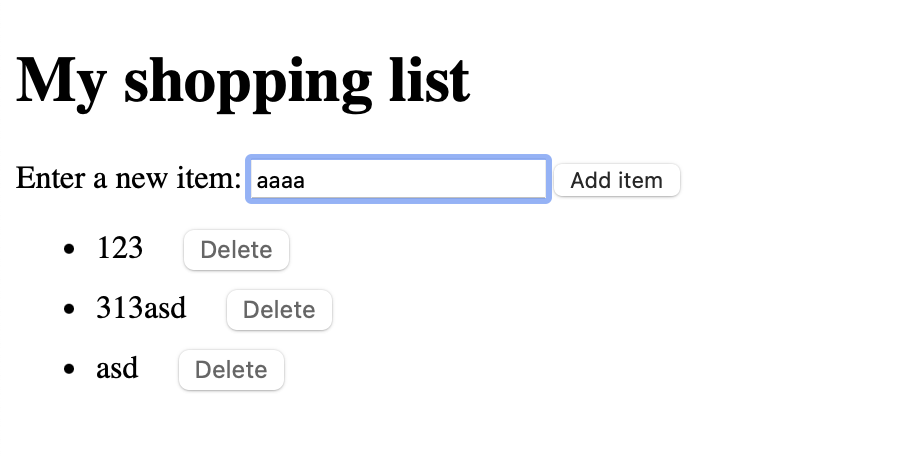

## 目录

- [API分为两种](#API分为两种)
  - [API是基于对象进行工作的](#API是基于对象进行工作的)
  - [XMLHttpRequest对象](#XMLHttpRequest对象)
- [querySelector和querySelectorAll](#querySelector和querySelectorAll)
- [创建并放置新的节点](#创建并放置新的节点)
- [移动和删除元素](#移动和删除元素)
- [操作样式](#操作样式)
- [从服务器获取数据](#从服务器获取数据)
  [FetchAPI](#FetchAPI)
  


# API分为两种
- 常见浏览器 API
  - 操作文档的 API内置于浏览器中
  - 从服务器获取数据的 API 用于更新网页的一小部分是相当好用的
  - 用于绘制和操作图形的 API目前已被浏览器广泛支持 — 最流行的是允许你以编程方式更新包含在 HTML `<canvas>` 元素中的像素数据以创建 2D 和 3D 场景的Canvas和WebGL。
  - 音频和视频 API 例如 HTMLMediaElement、Web Audio API 和 WebRTC 允许你使用多媒体来做一些非常有趣的事情，比如创建用于播放音频和视频的自定义 UI 控件，显示字幕字幕和你的视频，从网络摄像机抓取视频，通过画布操纵（见上），或在网络会议中显示在别人的电脑上，或者添加效果到音轨（如增益、失真、平移等） 。
  - 设备 API基本上是以对网络应用程序有用的方式操作和检索现代设备硬件中的数据的 API。
  - 客户端存储 API在 Web 浏览器中的使用变得越来越普遍 - 如果你想创建一个应用程序来保存页面加载之间的状态，甚至让设备在处于脱机状态时可用，那么在客户端存储数据将会是非常有用的。
- 常见第三方 API
  - The Twitter API, 允许你在你的网站上展示你最近的推文等。
  - The Google Maps API 允许你在网页上对地图进行很多操作（这很有趣，它也是 Google 地图的驱动器）。现在它是一整套完整的，能够胜任广泛任务的 API。其能力已经被Google Maps API Picker见证。
  - The Facebook suite of API 允许你将很多 Facebook 生态系统中的功能应用到你的 app，使之受益，比如说它提供了通过 Facebook 账户登录、接受应用内支付、推送有针对性的广告活动等功能。
  - The YouTube API, 允许你将 Youtube 上的视频嵌入到网站中去，同时提供搜索 Youtube，创建播放列表等众多功能。
  - The Twilio API, 其为你的 app 提供了针对语音通话和视频聊天的框架，以及从你的 app 发送短信息或多媒体信息等诸多功能。


## API是基于对象进行工作的
API 使用一个或多个 JavaScript objects 在你的代码中进行交互，这些对象用作 API 使用的数据（包含在对象属性中）的容器以及 API 提供的功能（包含在对象方法中）。

- Geolocation, 其中包含三种控制地理数据检索的方法
- Position, 表示在给定的时间的相关设备的位置。 — 它包含一个当前位置的 Coordinates 对象。还包含了一个时间戳，这个时间戳表示获取到位置的时间。
- Coordinates, 其中包含有关设备位置的大量有用数据，包括经纬度，高度，运动速度和运动方向等。

```js
navigator.geolocation.getCurrentPosition(function (position) {
  var latlng = new google.maps.LatLng(
    position.coords.latitude,
    position.coords.longitude,
  );
  var myOptions = {
    zoom: 8,
    center: latlng,
    mapTypeId: google.maps.MapTypeId.TERRAIN,
    disableDefaultUI: true,
  };
  var map = new google.maps.Map(
    document.querySelector("#map_canvas"),
    myOptions,
  );
});
// 我们首先要使用 Geolocation.getCurrentPosition() 方法返回设备的当前位置。
// 浏览器的 Geolocation 对象通过调用 Navigator.geolocation 属性来访问。


var position = navigator.geolocation.getCurrentPosition();
var myLatitude = position.coords.latitude;
```


## XMLHttpRequest对象
```js
var requestURL =
  "https://mdn.github.io/learning-area/javascript/oojs/json/superheroes.json";
var request = new XMLHttpRequest();
request.open("GET", requestURL);
request.responseType = "json";
request.send();

request.onload = function () {
  var superHeroes = request.response;
  populateHeader(superHeroes);
  showHeroes(superHeroes);
};

前五行指定了我们要获取的资源的位置，使用XMLHttpRequest() 构造函数创建请求对象的新实例，打开 HTTP 的 GET 请求以取得指定资源，指定响应以 JSON 格式发送，然后发送请求。

然后 onload 处理函数指定我们如何处理响应。我们知道请求会成功返回，并在需要加载事件（如onload 事件）之后可用（除非发生错误），所以我们将包含返回的 JSON 的响应保存在superHeroes变量中，然后将其传递给两个不同的函数以供进一步处理。
```

# querySelector和querySelectorAll
```js
// 点击按钮后切换
let buf = document.querySelector("#but"); // 查找最近的一个
buf.addEventListener("click", (e) => {
  let tagAlist = document.querySelectorAll("a");   // 查找全的的 a 标签，返回数组
  tagAlist.forEach( (e)=> {
    e.textContent = "123";
    console.log(e);
  });
});
```


# 创建并放置新的节点
```js
const sect = document.querySelector("section");

//用 document.createElement() 创建一个新的段落，用与之前相同的方法赋予相同的文本：
const para = document.createElement("p");
para.textContent = "We hope you enjoyed the ride.";

// 用 Node.appendChild() 方法在后面追加新的段落：
sect.appendChild(para);

// 使用 document.createTextNode() 创建一个文本节点：
const text = document.createTextNode(
  " — the premier source for web development knowledge.",
);

// 获取内部连接的段落的引用，并把文本节点附加到这个节点上：
const linkPara = document.querySelector("p");
linkPara.appendChild(text);
```

# 移动和删除元素
```js
const sect = document.querySelector("section");
const linkPara = document.querySelector("p");
linkPara.appendChild(text);

// 把具有内部链接的段落移到 section 的底部，简单的做法是：
sect.appendChild(linkPara);

// 这样可以把段落下移到 section 的底部。你可能认为它会产生第二个副本，但事实并非如此——linkPara 是对该段落唯一副本的引用。如果你想复制并添加它，你需要使用 Node.cloneNode() 来代替。
// 删除节点也非常的简单，至少，你拥有要删除的节点和其父节点的引用。在当前情况下，我们只要使用 Node.removeChild() 即可，如下：

sect.removeChild(linkPara);

// 要删除一个仅基于自身引用的节点可能稍微有点复杂，这也是很常见的。你可以使用 Element.remove()：
linkPara.remove();

// 此方法在较旧的浏览器中不受支持，它们没有方法告诉一个节点删除自己，所以你必须这样做：
linkPara.parentNode.removeChild(linkPara);

```
# 操作样式
```js
const para = document.createElement("p");
para.textContent = "We hope you enjoyed the ride.";

// 用 Node.appendChild() 方法在后面追加新的段落：
sect.appendChild(para);
// 直接设置属性即可
// CSS 样式的 JavaScript 属性版本是用小驼峰命名法书写的，而 CSS 版本是连字符的（例如，backgroundColor 对 background-color）。
// 确保你不要把这些混为一谈，否则将无法工作。
para.style.color = "white";
para.style.backgroundColor = "black";
para.style.padding = "10px";
para.style.width = "250px";
para.style.textAlign = "center";
```
下面是点击页面按钮新增元素
```html
<!DOCTYPE html>
<html lang="en-US">
  <head>
    <meta charset="utf-8">
    <meta name="viewport" content="width=device-width, initial-scale=1.0">
    <title>Shopping list example</title>
    <style>
      li {
        margin-bottom: 10px;
      }

      li button {
        font-size: 12px;
        margin-left: 20px;
        color: #666;
      }
    </style>
  </head>
  <body>

    <h1>My shopping list</h1>

    <div>
      <label for="item">Enter a new item:</label>
      <input type="text" name="item" id="item">
      <button>Add item</button>
    </div>

    <ul>

    </ul>

    <script>
      const list = document.querySelector('ul');
      const input = document.querySelector('input');
      const button = document.querySelector('button');

      button.addEventListener('click', () => {
        const myItem = input.value;
        input.value = '';

        const listItem = document.createElement('li');
        const listText = document.createElement('span');
        const listBtn = document.createElement('button');

        listItem.appendChild(listText);
        listText.textContent = myItem;
        listItem.appendChild(listBtn);
        listBtn.textContent = 'Delete';
        list.appendChild(listItem);

        listBtn.addEventListener('click', () => {
          list.removeChild(listItem);
        });

        input.focus();
      });
    </script>
  </body>
</html>
```


# 从服务器获取数据
## FetchAPI


